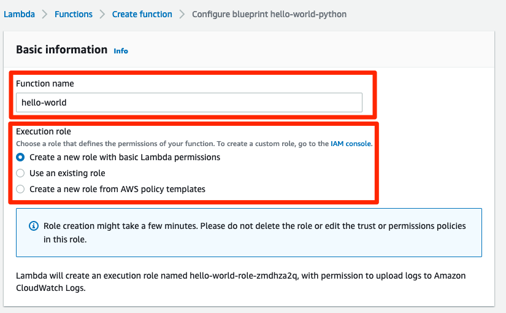
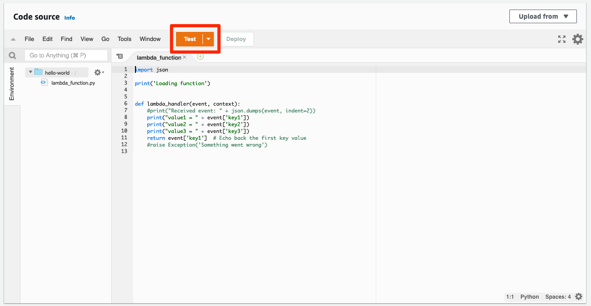
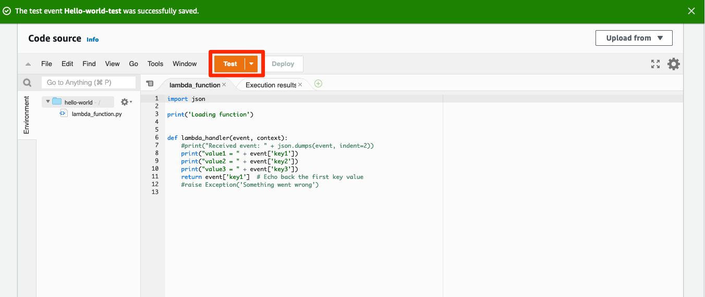

# Hello world Lambda 생성
## Hello world Lambda 생성하기
1. 콘솔창에서 Lambda를 검색하여 Lambda 콘솔로 들어갑니다. 앞으로 많이 쓸 서비스이기 때문에 옆에 별표를 눌러서 자주쓰는 서비스로 등록해 두시면 좋습니다.


2. Lambda 콘솔에서는 오른쪽 메뉴에 있는 Functions 를 눌러서 들어가줍니다. 이번 세션에서는 이 Functions 기능을 주로 사용하여 서비스를 만들어 볼 것입니다. 지금 단계에서는 아무런 웹페이지도 볼 수 없습니다. 하지만 실망하지 마세요. 이번에 Lambda 에 대해서 알아보는 시간을 가지고 바로 다음번에는 실제로 웹페이지를 만들어 보는 시간을 가질 것입니다.


3. Create function 버튼을 눌러줍니다.


4. Lambda functions를 만들 때에는 4가지 방법을 이용하실 수 있습니다. 이 중 가장 쉽고 편하게 만들 수 있는 방법이 AWS 에서 제공하는 blueprint 로 만드는 방법입니다. 네가지 방법 중 Use a blueprint 를 클릭하세요.


> Blueprint 는 Lambda 를 편하게 만드실 수 있도록 AWS 에서 제공하는 완성된 설계도라고 보시면 됩니다. Blueprint 에 원하는 기능을 찾으셨다면 가장 쉽고 빠르게 Lambda 를 만들어 보실 수 있습니다. 좀 더 알고 싶으시면 blueprint  페이지에서 '함수 블루프린트' 항목을 살펴보시기 바랍니다.

5. 많은 blueprint 중에서 hello-world 서비스를 만들어 볼 것입니다. Blueprints 아래 검색창에 hello 를 치면 nodejs 와 python버젼이 나오는데, 이 중 python 버젼으로 선택후, Configure 버튼을 눌러줍니다.


6. 이제 Basic information 창으로 넘어가게 됩니다. 여기에서는 functions 를 생성하기 전 기본적인 설정을 해주는 공간입니다. 이름과 권한을 설정할 수 있습니다. 이름으로는 hello-world 를 입력하고, Execution role 은 Create a new role with basic Lambda permissions 로 지정합니다.



7. 밑으로 내려서 오른쪽 아래에 있는 create function 버튼을 눌러 function을 생성합니다.


> AWS 에서 권한을 설정하는 것은 중요합니다. AWS 내의 여러 서비스들은 서로에 대한 권한이 있어야만 호출하거나 사용할 수 있습니다. 지금 여기서는 나중에 에러를 처리하거나 로그를 확인하는 등의 관리 활동을 위한 Cloudwatch 의 권한만 열어두게 되는데, 이따가 만들어 볼 Lambda 는 좀더 다양한 권한을 넣어야 합니다.

8. 금방 서비스가 만들어졌습니다. 서비스가 만들어졌으니, 제대로 만들어졌는지 테스트를 해보겠습니다. Test 버튼을 눌러서 테스트를 진행합니다.



9. Test 버튼을 누르면 테스트창이 뜨게 되는데, 여기에서 어떻게 테스트를 해 볼 것인지를 정해주어야 합니다. Event name은 Hello-world-test 로 작성합니다. 아래에는 테스트를 공유할 것인지를 묻는 항목인데, 이번에는 공유하지 않으므로, Private으로 두고, Template 도 그대로 두겠습니다.


10. Event JSON 항목에는 이미 값들이 채워져 있을 것입니다. 이 부분을 다 지우고, 아래를 복사해서 붙여 놓습니다. 그 다음 오른쪽 아래의 Save 를 눌러서 저장합니다.

```
{
  "key1": "Hello!",
  "key2": "value2",
  "key3": "value3"
}
```


11. 이제 Test 를 해보겠습니다. Test 버튼을 눌러줍니다.



12. 원래는 한개의 창이 있던 화면에 Execution results 창이 생기고 결과가 출력되어서 나옵니다. 아까 9번에서 지정했던 테스트 이름인 Hello-world-test 도 잘 적혀서 나오고, Response 로는 Hello! 가 나오면 성공입니다.


> 왜 Response, 결과값으로 Hello! 가 나올까요? 이에 대해서 궁금하시면 10번을 다시 보시기 바랍니다.

이제 Lambda 에 대해서 조금 알게 되셨다면, 본격적으로 웹 페이지를 만들어 보겠습니다.
