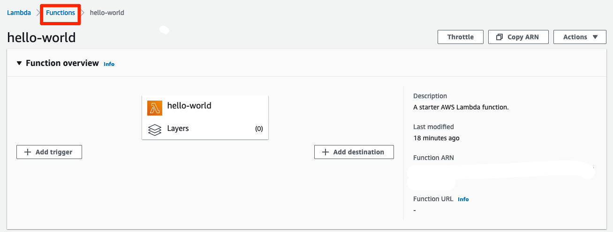
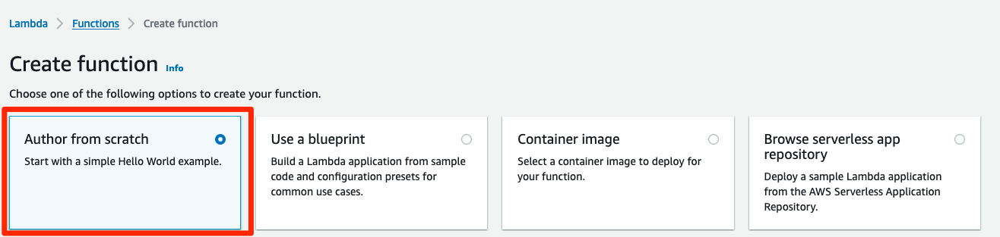
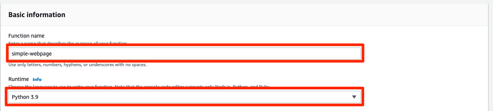
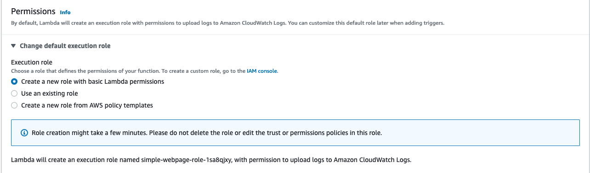
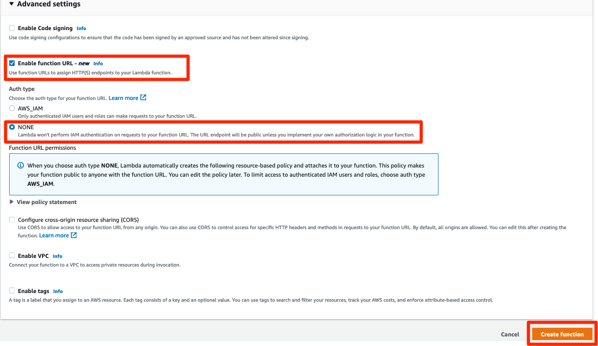
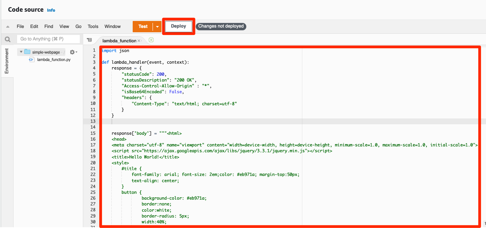
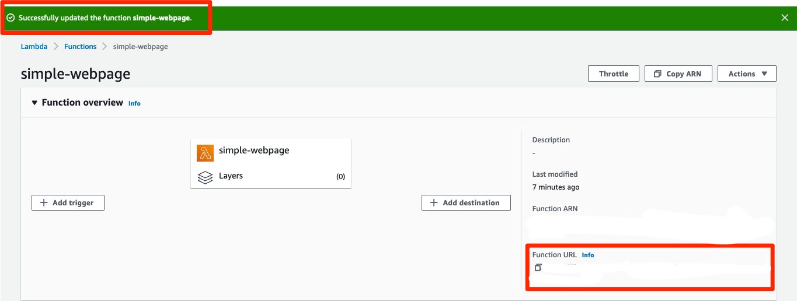

# Webpage Lambda 생성
## Simple webpage Lambda 생성하기
1. 맨 위에 있는 Functions 를 눌러 다시 Functions 창으로 돌아갑니다.



2. 아까와 마찬가지로 Create Function 을 눌러서 들어간 다음, 이번에는 Author from scratch 를 선택합니다. 이번에는 아까처럼 Blueprint 를 이용하는 게 아니라, 직접 만들어 보겠습니다. 간단한 웹페이지를 띄워보겠습니다.



3. Function name 으로는 simple-webpage를 입력하고, Runtime으로는 python 3.9 를 선택합니다.



4. Permissions은 아까와 똑같이 Create a new role with basic Lambda permissions 를 선택합니다.



5. Advanced settings 에서 Enable function URL 을 선택합니다. 그리고 Auth type 으로는 NONE 을 선택합니다. 여기까지 선택하셨으면, 왼쪽 아래의 Create function을 누릅니다.



> 원래 Lambda 자체로는 외부에서 호출을 할 수 없습니다. 따라서 아까 만들었던 hello-world lambda 의 경우 외부 인터넷에서 호출해서 볼 수 없습니다. 이번에는 외부에서도 저희가 이번 시간에 만든 서비스를 볼 수 있게 Function URL 기능을 통해 호출 가능한 URL 을 만들어 보겠습니다. 여기서는 Auth type을 NONE으로 했는데, 실제 서비스를 만드실 때에는 인증 절차를 거친 사용자만 호출할 수 있게 하셔야 합니다.

6. 앞서 만들었던 hello-world는 AWS 의 템플릿을 사용해서 바로 Test 를 해볼 수 있었지만, 이번에는 새로 직접 만드는 과정이기 때문에 직접 소스코드를 입력해야 합니다. 아래의 소스코드를 복사해서 창으로 붙여넣으세요. 붙여넣게 되면 자동으로 Deploy 버튼이 활성화되면서 옆에 Changes not deployed 라는 문구가 뜹니다. 이 Deploy 버튼을 누르세요.

```
import json

def lambda_handler(event, context):
    response = {
        "statusCode": 200,
        "statusDescription": "200 OK",
        "Access-Control-Allow-Origin" : "*",
        "isBase64Encoded": False,
        "headers": {
            "Content-Type": "text/html; charset=utf-8"
        }
    }

    response['body'] = """<html>
    <head>
    <meta charset="utf-8" name="viewport" content="width=device-width, height=device-height, minimum-scale=1.0, maximum-scale=1.0, initial-scale=1.0">
    <script src="https://ajax.googleapis.com/ajax/libs/jquery/3.3.1/jquery.min.js"></script>
    <title>Hello World!</title>
    <style>
        #title {
            font-family: arial; font-size: 2em;color: #eb971a; margin-top:50px;
            text-align: center;
        }
        button {
                background-color: #eb971a;
                border:none;
                color:white;
                border-radius: 5px;
                width:40%;
                height:35px;
                font-size: 13pt;
                margin-top:30px;
                text-align: center;
        }
        #sentence {
                font-size: 17pt;
                margin-top:30px;
                font-weight: bold;
                color: #eb971a;
        }
    </style>
        </head>
        <body>
            <p id="title">Hello World From <b>Lambda</b></p>
            <hr id="lambda-line" width="800px" align="center" color="#eb971a;">
            <center><button onclick="checkEvent();">Who are you?</button></center>
            <center><div id="sentence"></div></center>
        </body>
        <script type="text/javascript">
        
            function checkEvent(){
                $.ajax({ type: "GET", 
                        url: "URL을입력하세요", 
                        dataType:'json',
                        success: function(data){ 
                        document.getElementById('sentence').innerHTML = data.status + "&nbsp;&nbsp;" + data.name
                        }, 
                        error: function (error){
                        alert('ERROR::');
                        console.log(error)
                        }

                });
            }

        </script>
        </html>
            
        """
        
    return response
```



> 이 코드는 무엇을 의미하는 것일까요? 기본적으로 웹페이지가 생성되어 사용자에게 보여질때에는 사용자가 요청을 보내고, 이 요청에 따라 서버가 응답으로 HTML 을 보내는 것으로 사용자가 웹 상에서 볼 수 있는 화면을 구성하게 됩니다. 이 코드에서도 보시면 response 쪽에 Content-Type 을 text/html로 지정해서 응답을 주고 있는 것을 알 수 있습니다. 응답으로 사용되는 HTML 코드는 그 아래에 존재합니다. HTML 을 좀 더 공부해 보고 싶으신 분들이라면, HTML  사이트를 참고하시기 바랍니다.

7. 이제 위로 올려 보시면 초록색으로 Successfully updated the function simple-webpage. 문구가 뜨실 겁니다. 이 문구를 확인하면, 왼쪽에 있는 Functions URL 아래에 있는 URL 을 클릭합니다.



8. 새로운 창이 열리면서 이번에 만든 웹페이지가 호출됩니다. 버튼을 클릭해 보시면 아직까지는 ERROR 가 뜹니다.


이렇게 웹페이지까지 간단하게 만들어 보았습니다. 이번에는 만들어본 웹페이지의 버튼이 제대로 동작할 수 있도록 기능을 만들어 보겠습니다.


