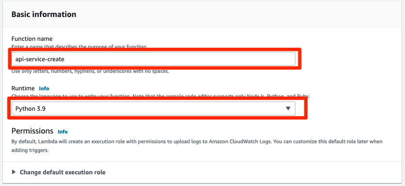
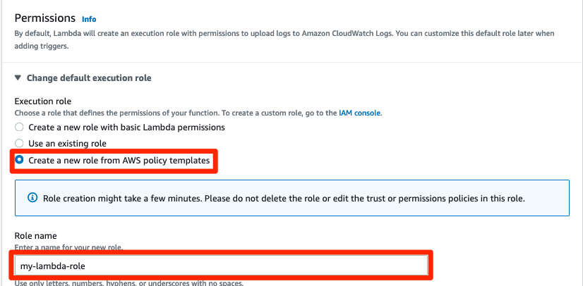
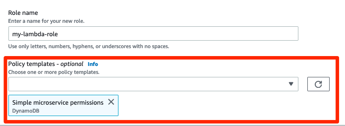
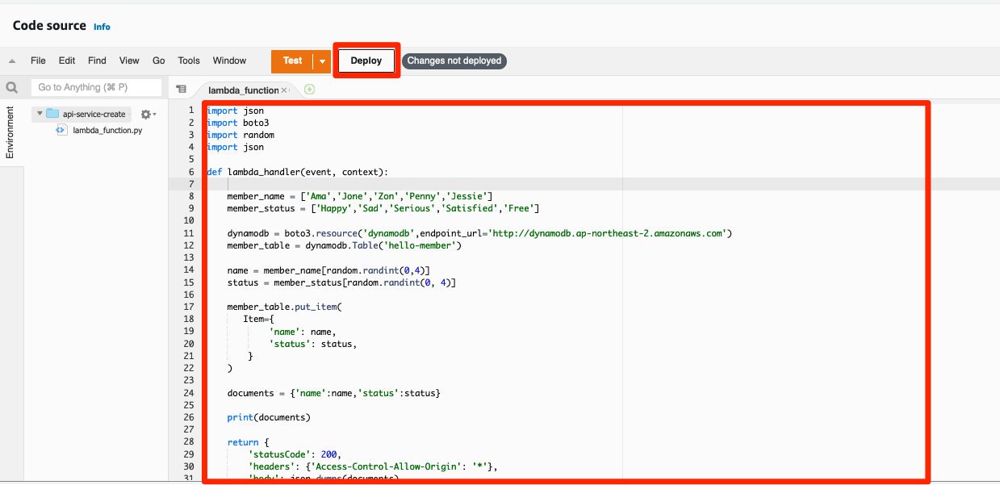
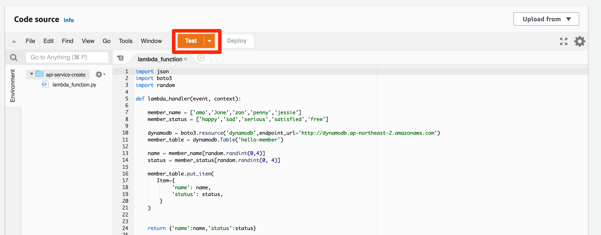
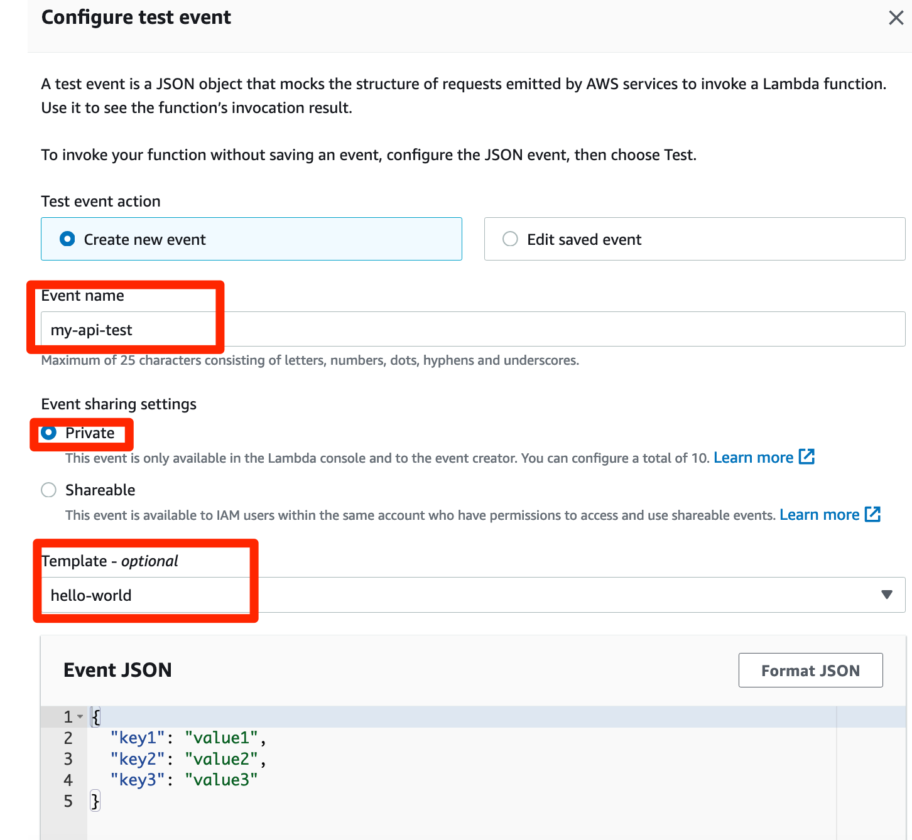
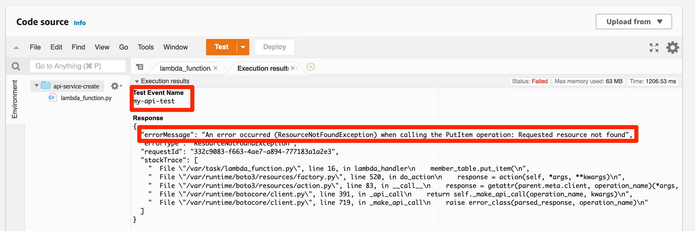
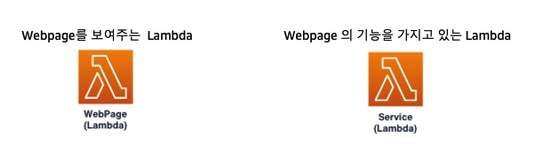

# Api service lambda 생성
## Api service lambda 생성하기
1. 맨 위에 있는 Functions 를 눌러 다시 Functions 창으로 돌아갑니다. 아까는 빈껍데기 웹페이지를 만들었다면 이번에는 빈껍데기 웹페이지가 동적으로 반응하면서 좀 더 사용자에게 재미를 줄 수 있도록 기능을 추가해 보겠습니다. Simple webpage Lambda 생성하기 단계를 아직 끝내지 못했다면 서포터분들과 먼저 하신다음에 이 단계를 따라오셔야 합니다.


2. 아까와 마찬가지로 Create Function 을 눌러서 들어간 다음, 이번에도 Author from scratch 를 선택합니다.


3. Function name 으로는 api-service-create를 입력하고, Runtime으로는 python 3.9 를 선택합니다.



4. 이번에는 Permissions 을 직접 생성해 보도록 하겠습니다. Permissions 섹션에서 Execution role 의 Create a new role from AWS policy templates 를 선택합니다. Role name으로는 my-lambda-role으로 작성합니다.



5. 이번 Function을 만든 다음에는 NoSQL 데이터베이스 서비스인 AWS DynamoDB와 연결할 예정입니다. 앞서 말씀드린 것처럼 AWS 서비스끼리 서로와 연결하거나 이용하거나 호출하거나 할 때에는 권한이 필요합니다. Simple microservice permissions DynamoDB 를 선택합니다. 그리고 오른쪽 아래의 Create 버튼을 눌러 다음으로 이동합니다.



6. Code source 에 아래를 복사 붙여넣기 한 다음 Deploy 를 누릅니다.

```
import json
import boto3
import random
import json

def lambda_handler(event, context):
    
    member_name = ['Ama','Jone','Zon','Penny','Jessie']
    member_status = ['Happy','Sad','Serious','Satisfied','Free']
    
    dynamodb = boto3.resource('dynamodb',endpoint_url='http://dynamodb.ap-northeast-2.amazonaws.com')
    member_table = dynamodb.Table('hello-member')
    
    name = member_name[random.randint(0,4)]
    status = member_status[random.randint(0, 4)]
    
    member_table.put_item(
       Item={
            'name': name,
            'status': status,
        }
    )
    
    documents = {'name':name,'status':status}
    
    print(documents)
    
    return {
        'statusCode': 200,
        'headers': {'Access-Control-Allow-Origin': '*'},
        'body': json.dumps(documents)
    }
```



> 앞서 만들었던 것이 웹페이지라면, 이번에는 웹페이지에 들어갈 기능을 추가합니다. 멤버의 이름과 기분 상태를 랜덤으로 매핑시켜주고, 이를 DynamoDB에 저장하는 기능입니다.

7. 이제 Test 버튼을 누릅니다.



8. Configure test event 에는 다음과 같이 입력합니다. Event name 으로는 my-api-test 를 입력하고, Event sharing settings 으로는 Private 을 선택합니다. Template은 hello-world를 선택합니다.



9. 이제 Test 버튼을 누르면 테스트가 진행됩니다.아직은 DynamoDB를 만들지 못한 상태여서 다음과 같은 에러가 나게 됩니다. 에러가 나는 것이 정상입니다.



여기까지 만들었다면, 두 개의 Lambda 함수를 만든 것입니다.



이제 이 function에 연결할 dynamoDB 를 만들어 보겠습니다.
