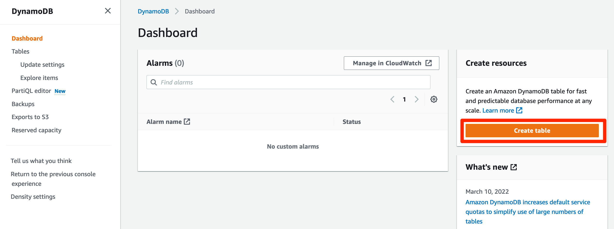
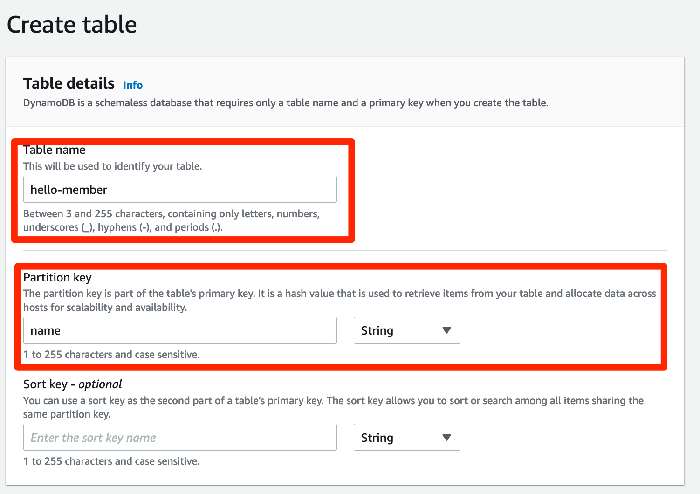
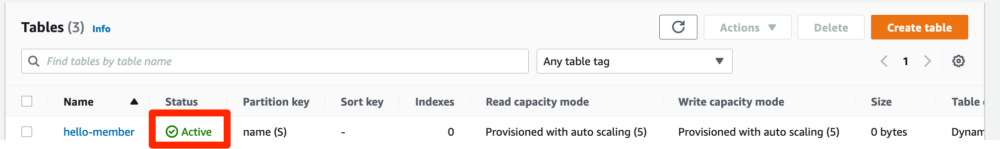
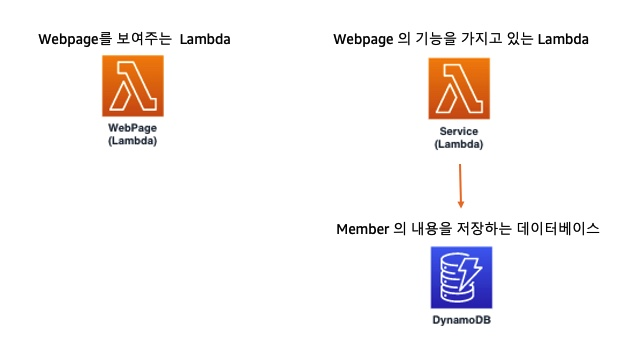

# DynamoDB 생성
## DynamoDB 생성하기
1. DynamoDB 를 콘솔창에서 검색해서 들어갑니다. 서비스에 연결할 DynamoDB 테이블을 만들게 되면 멤버의 이름과 성격을 저장해 놓을 수 있습니다. hello-member 라는 이름을 가진 테이블을 생성하려고 합니다.

2. DynamoDB 콘솔로 들어가서 왼쪽의 create table 버튼을 누릅니다.

3. Table name 은 hello-member 로, Partition key는 name 으로 작성합니다. 이 이름은 꼭 똑같이 작성해 주셔야 이후 에러가 나지 않습니다. 작성하신 다음에는 쭉 내려서 오른쪽 아래의 create table 버튼을 눌러서 생성합니다.

4. 아래처럼 Status 가 Active 가 될 때까지 기다립니다. 시간이 다소 걸립니다.

이렇게 hello-member 이름을 가지고 name 이라는 기본키를 가진 테이블을 생성하였습니다. 이제 api gateway를 생성하러 가겠습니다. 지금까지의 구조도는 이렇습니다.

