# Api gateway 생성
## Api gateway 생성하기
1. 방금 전 그림에서 보셧듯, 현재는 웹페이지에서 기능을 이용할 수 없게 서로 떨어져 있는 것을 볼 수 있습니다. 이번에는 웹페이지가 기능을 사용할 수 있도록, 즉 기능을 호출할 수 있도록 Api gateway 를 구성하여 호출 통로를 만들어보겠습니다. Api gateway 를 콘솔창에서 검색해서 들어갑니다.

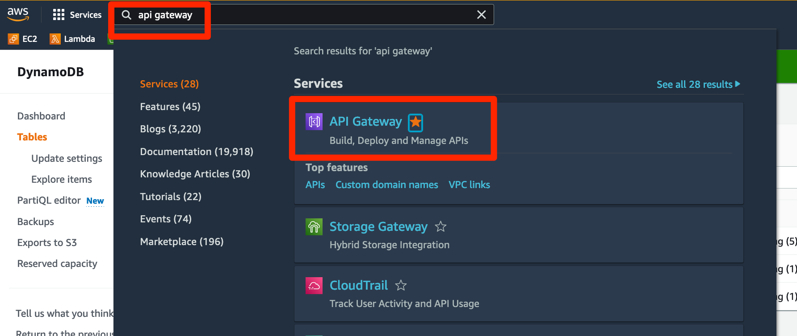

2. 왼쪽의 APIs 메뉴로 들어갑니다.

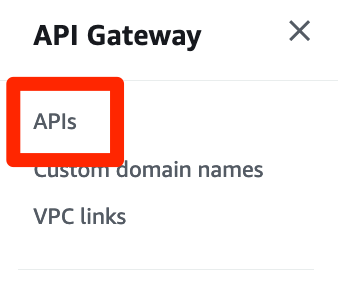

3. 오른쪽에 있는 create API 버튼을 누릅니다.

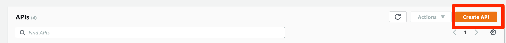

4. 이 다음으로는 어떤 API 형태를 만들어야 하는지를 결정해야 하는데 이번에는 HTTP API 보다 API 관리 기능이 더 추가되어 있는 REST API 로 생성해 보겠습니다. REST API 에서 Build 버튼을 누릅니다.

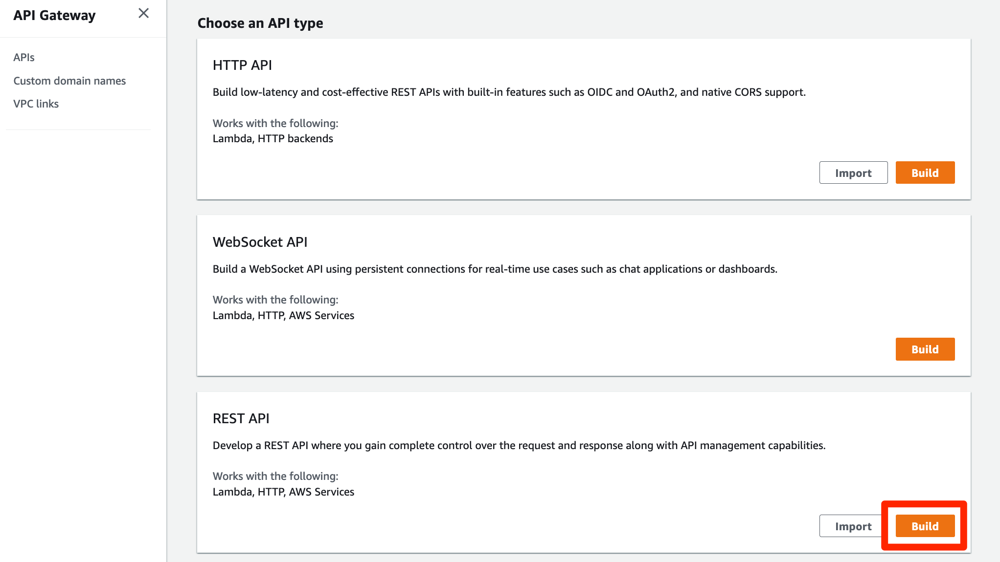

5. protocol 로는 REST 를, Create new API 로는 New API, Setting 에서는 API name 을 my-api로 지정합니다. 그 다음 create API 버튼을 누릅니다.

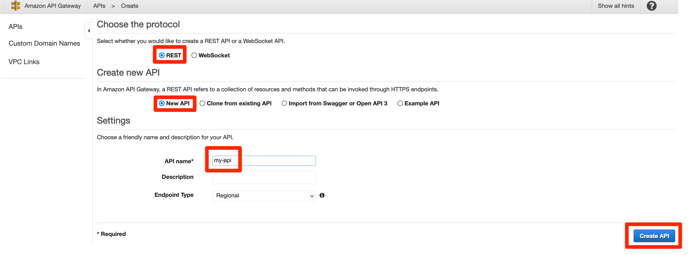

6. 들어간 화면에서 Actions 버튼을 누르고, 드롭다운 메뉴에서 Create Method 를 누릅니다.

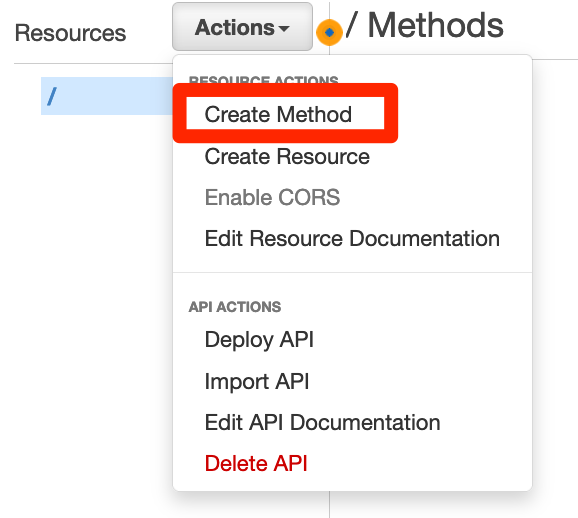

7. 누른다음 get 을 선택합니다.

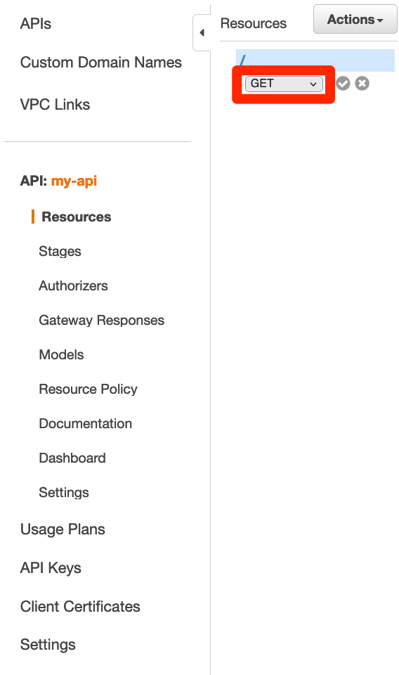

8. 그 다음 바로 옆에 있는 체크표시를 눌러서 저장합니다.

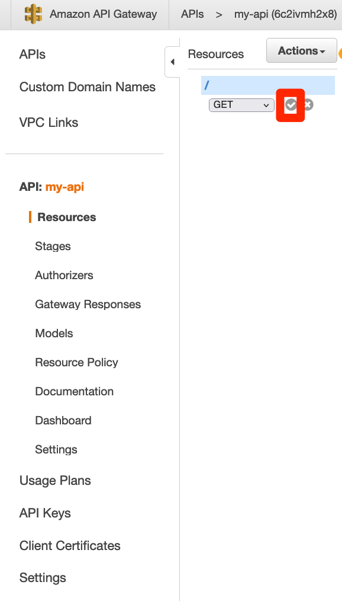

9. 저장하면 api 를 구성할 수 있는 화면이 나오게 됩니다. 여기에서 Integration type 을 Lambda Function 을 선택하고, Use Lambda Proxy integration 는 클릭해 줍니다. Lambda Function 에는 api-service-create 로 이름을 작성합니다. 다 작성했으면 맨 밑의 Save 버튼을 누릅니다. 아까 lambda의 이름을 다른 걸로 저장하셨다면 그 lambda 를 찾아서 넣어주시면 됩니다.

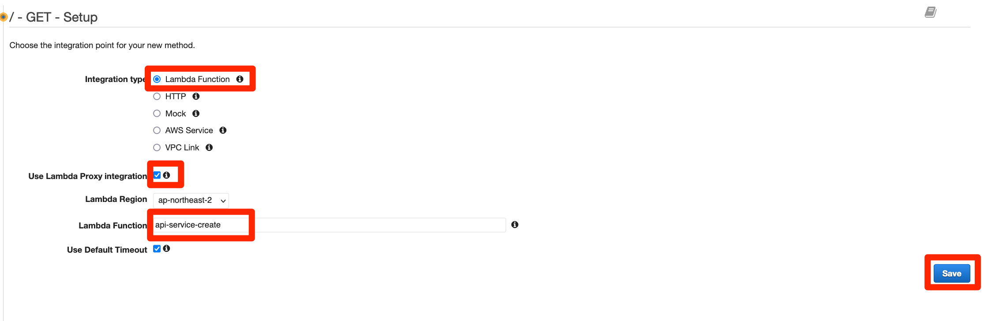

10. 아까 저희는 lambda에 dynamoDB 권한만 넣었습니다. 여기에 api gateway 권한을 또 추가해주는 창이 뜹니다. 여기에 OK 버튼을 눌러서 api gateway 에서 lambda 를 부를 수 있도록 구성해 줍니다.

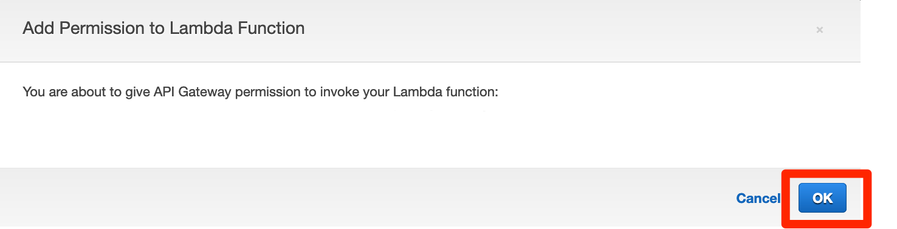

11. 이제 권한도 완성했으니, 부를 수 있는 준비가 다 되었습니다. Method Execution 창에서 TEST 버튼을 눌러 테스트를 준비합니다.

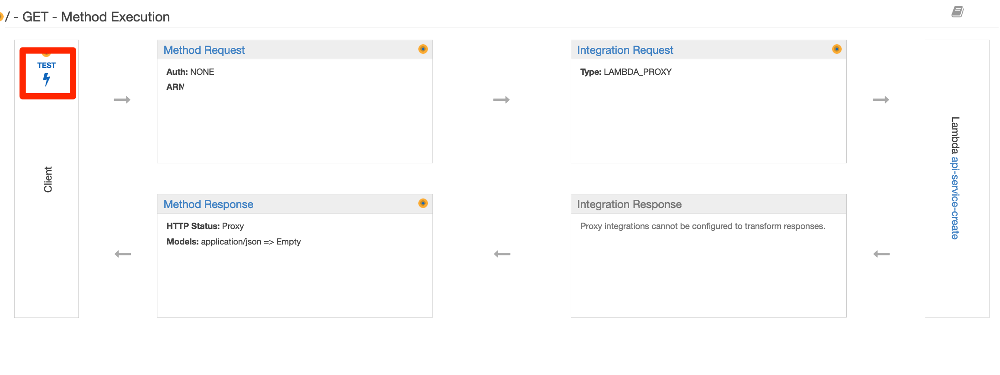

12. 들어간 화면에서 Test 버튼을 다시 눌러줍니다. 서비스가 더 복잡해지면 여기에서 Request Body 에 값을 추가하고 Headers 에도 추가할 수도 있지만, 지금은 아무 값도 넣지 않아도 됩니다.

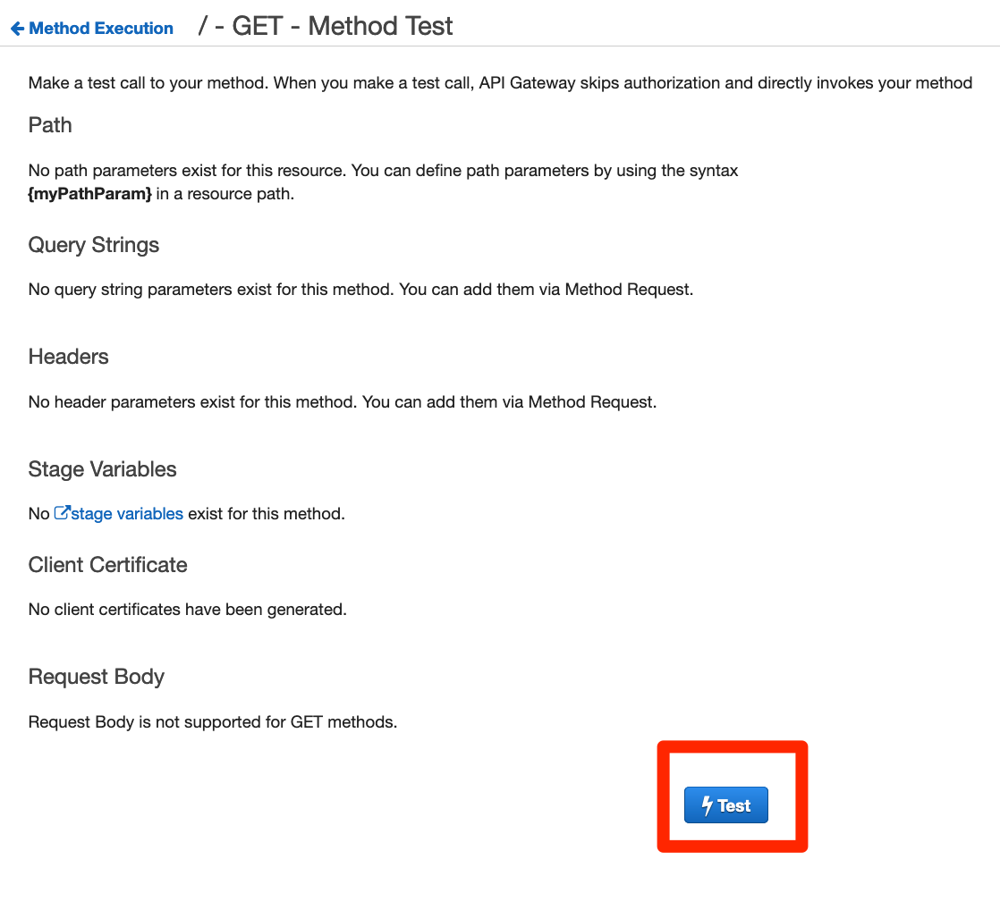

13. Test 가 성공하였다면, Status가 200으로 나오며, Response Body에 랜덤한 값이 나오게 됩니다. 그림과 다른 값이 나오실 수 있습니다.

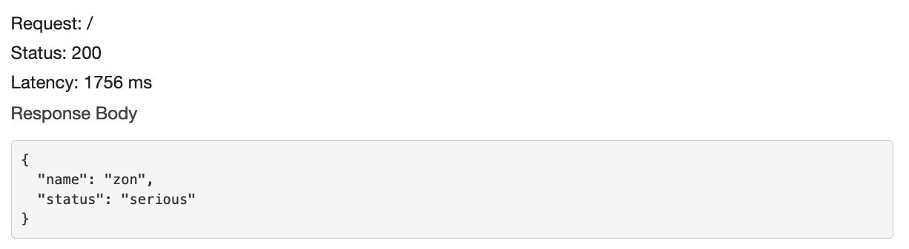
