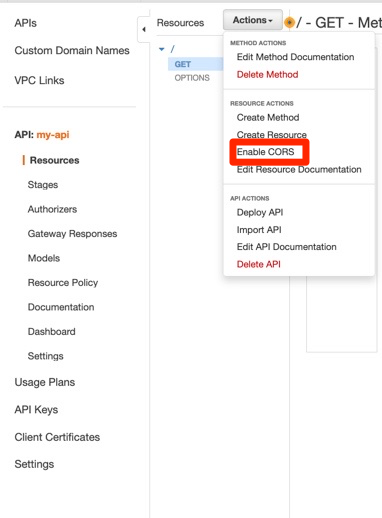
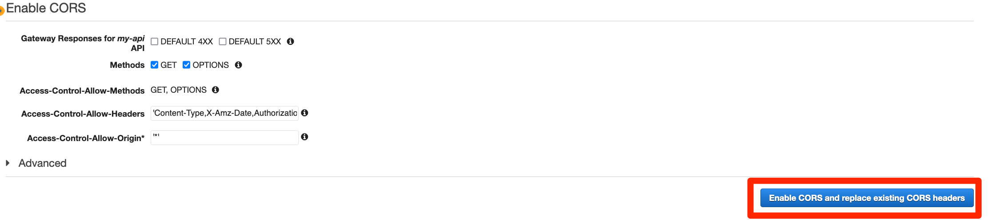
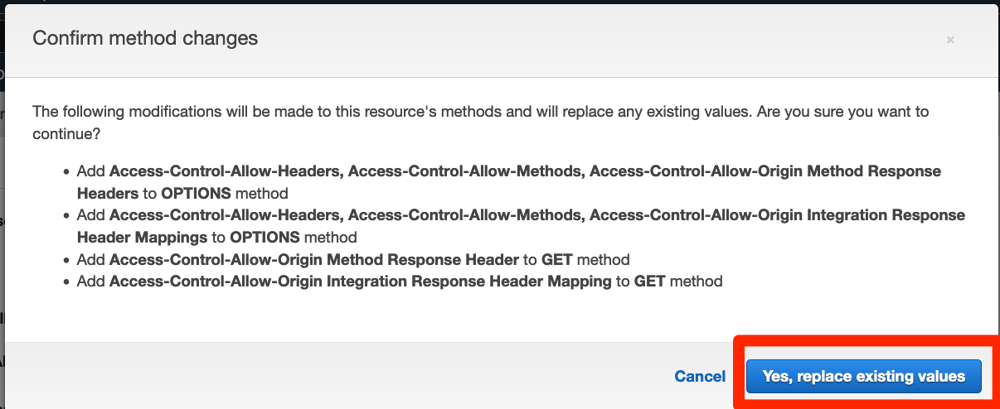
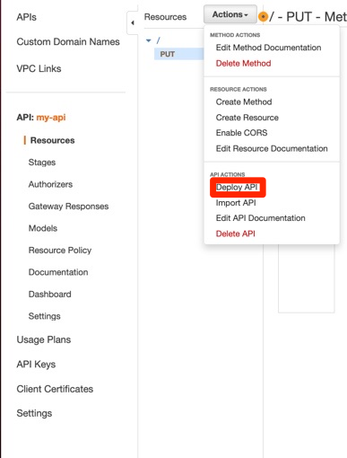
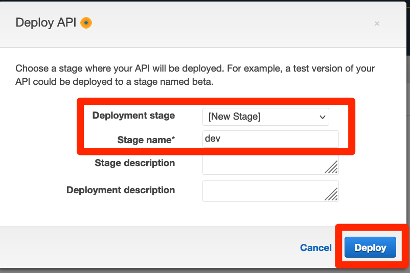
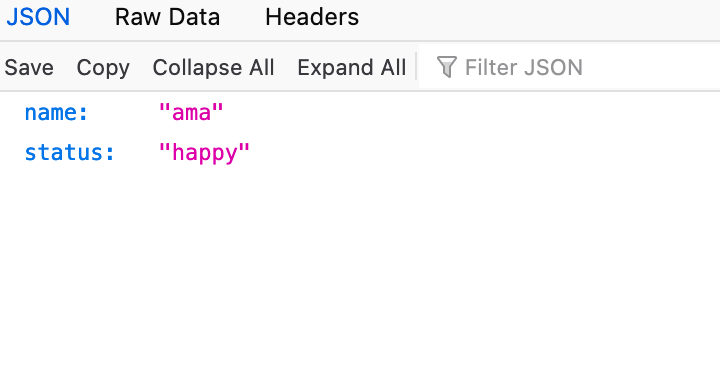
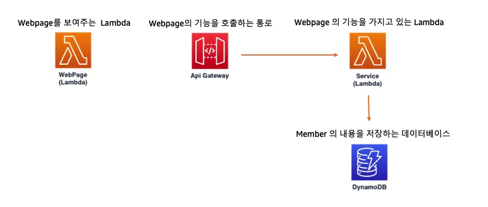

# Api gateway 추가 설정
## Api gateway 추가 설정하기
1. Api gateway 를 만들었지만, 바로 호출하면 CORS 관련 에러가 나게 될 것입니다. 따라서 호출이 정상적으로 이루어지기 위한 추가 설정을 하겠습니다. Actions 메뉴에서 Enable CORS 를 클릭합니다.

2. 나오는 창에서 Enable CORS and replace exisiting CORS headers 버튼을 클릭합니다.

3. 버튼을 누르면 나오는 창에서 Yes, replace existing values 를 선택합니다.

4. api 가 정상적으로 작동된다는 것을 확인하고, 추가 설정을 마쳤으니 이제 이 api 를 실제 사용할 수 있게 준비하겠습니다. Actions 에서 Deploy API 를 누릅니다.

5. 누르면 창이 뜨게 되는데, 여기에서 Deployment stage 에서는 [New Stage] 를 선택하고 Stage name 에서는 dev 를 입력합니다.

6. 완료되면 Invoke URL 이 나오게 됩니다. 이 URL 은 사람마다 모두 다릅니다. 이 URL 을 한번 눌러봅니다. 그러면 아래 그림처럼 나오게 됩니다. 문구는 랜덤으로 다를 수 있습니다. 이 URL 은 반드시 복사해서 메모장에 붙어넣으시기 바랍니다. 바로 다음 단계에서 활용합니다.

이제 다 왔습니다. 마지막으로 한 줄만 바꿔서 서비스를 완성해 보겠습니다. 지금은 아래의 그림처럼 완전하게 연결되어 있지 않지만, 한 줄만 바꾸면 서로간의 연결을 완성시킬 수 있습니다.

