# Lambda 와의 연결
## Lambda 와 다른 서비스 연결하기
1. 콘솔창에서 Lambda를 검색하여 Lambda 콘솔로 들어갑니다.

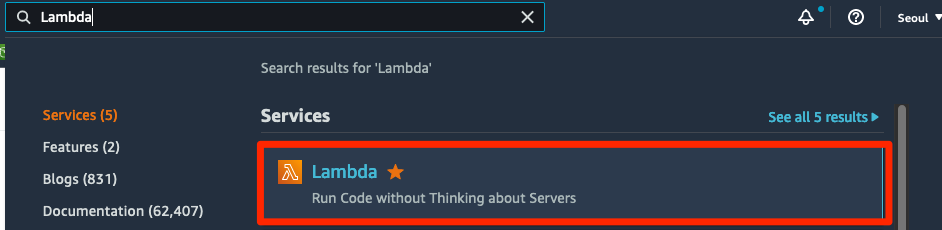

2. Lambda 콘솔에서는 오른쪽 메뉴에 있는 Functions 를 눌러서 들어가줍니다.

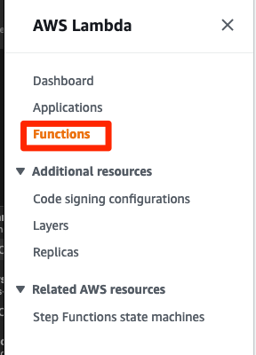

3. 그 전에 만들었던 simple-webpage function으로 들어갑니다. Simple webpage Lambda 생성하기 단계에서 만들었던 Lambda function 입니다.

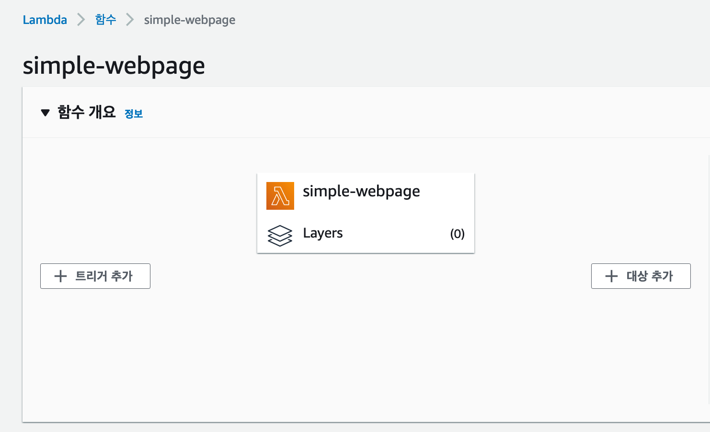

4. Code source 에는 저희가 만들었던 소스코드가 담겨져 있습니다. 여기에서 맨 밑으로 드래그 하면, URL을입력하세요 라는 문구를 찾을 수 있습니다. 53번째 줄을 확인해보세요. 이 문구를 아까 Api gateway 생성하기 메뉴에서 복사해 온 URL 로 대체 합니다. 이후 Deploy 버튼을 누릅니다.

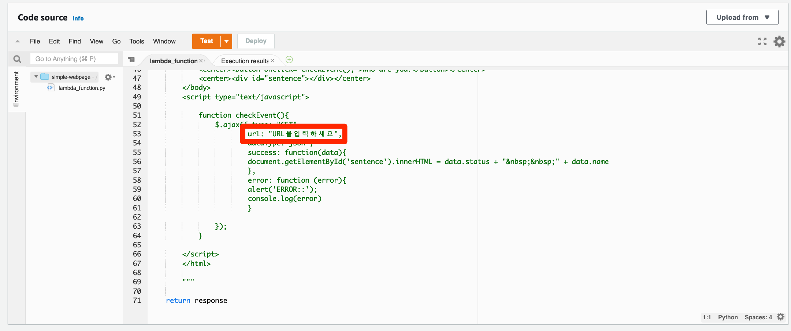

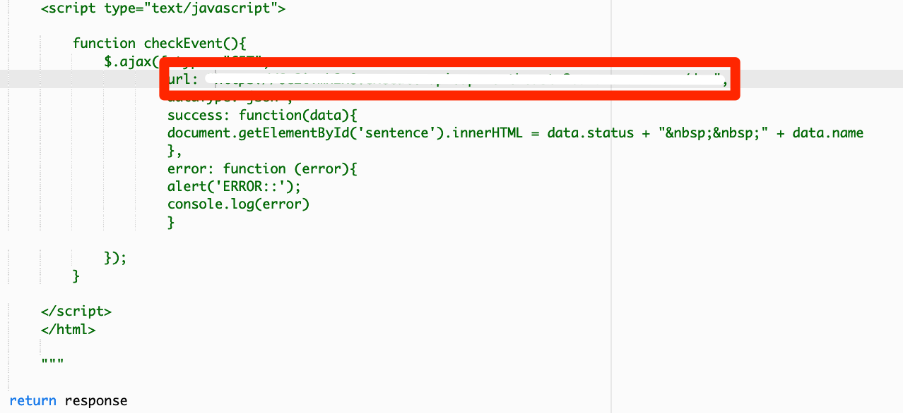

5. 이제 위로 올라가서 Function URL 에 있는 URL 로 다시 접속합니다.

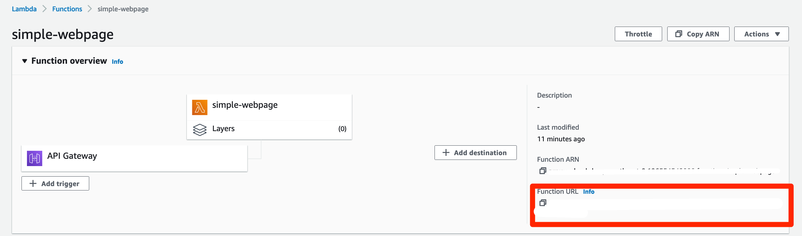

6. 이제 페이지의 버튼을 누르면, 버튼 아래에 문구가 떠오르며 실행이 됩니다. 문구는 버튼을 누를때마다 랜덤하게 바뀝니다. 서비스를 모두 생성하였습니다. 축하드립니다.

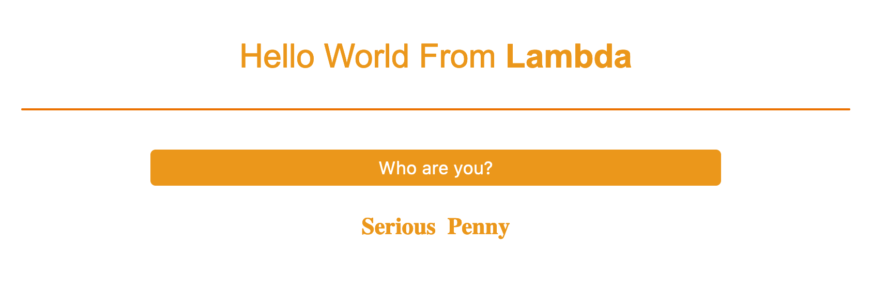

7. 이제 DynamoDB 데이터베이스에 이 문구가 실제로 저장되어 있는지를 확인해 보겠습니다. DynamoDB 를 콘솔창에서 검색해서 들어갑니다.

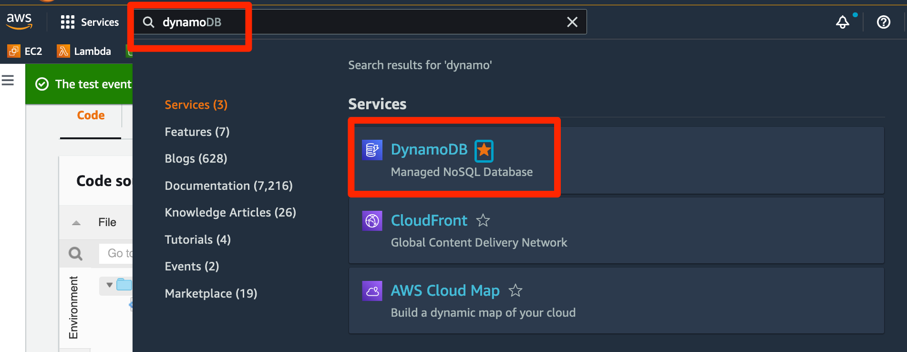

8. 왼쪽 옆 메뉴에서 Tables 에 들어갑니다.

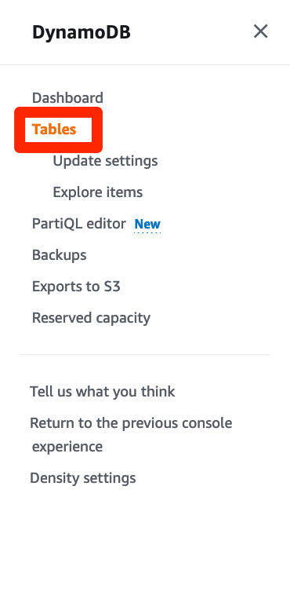

9. hello-member 테이블에 들어갑니다.

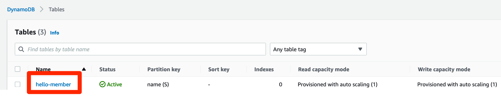

10. Explore table items 버튼을 선택하여 테이블 값들을 보도록 하겠습니다.

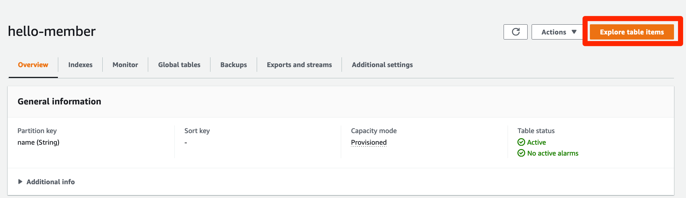

11. 아래에서 실제 값들이 들어있는 것을 볼 수 있습니다.

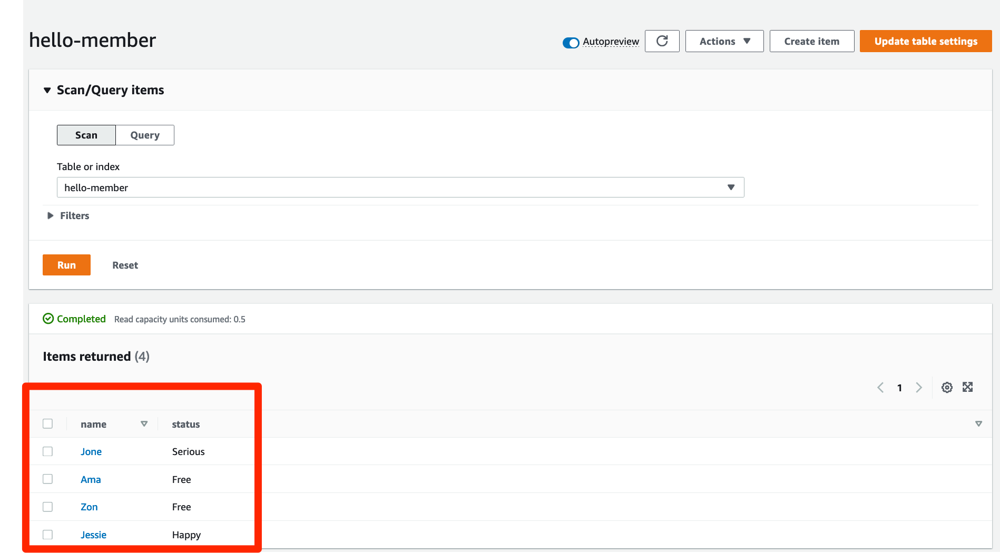

이렇게 해서 하나의 완성된 서비스를 만들어 보았습니다. 서버를 생각할 필요없이 서비스 구성에만 집중할 수 있다는 것이 서버리스의 장점이며, 익숙해 지신다면 더 빠른 속도로 만드실 수 있으실 겁니다. 아래의 그림을 보시면 이제 웹페이지와 서비스, 그리고 데이터베이스가 서로 연결이 되어 있는 모습을 볼 수 있습니다.

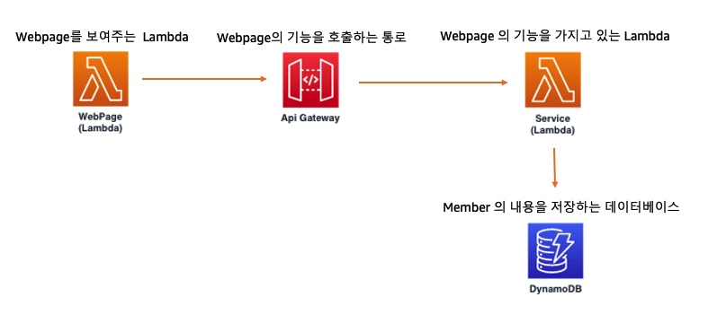
