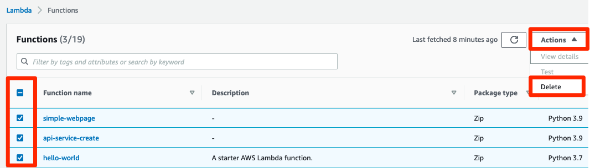

# 세션 실습 자원 삭제
## Lambda 삭제
[Lambda 콘솔](https://console.aws.amazon.com/lambda/home?region=ap-northeast-2) Functions 메뉴에서 오늘 생성한 Functions 3개를 선택한 후, Actions 메뉴에서 Delete 버튼을 클릭하여 삭제합니다.

## DynamoDB 삭제
DynamoDB 콘솔  Tables 메뉴에서 오늘 생성한 Table을 선택한 후, Delete를 눌러 삭제 합니다. 나오는 팝업창에는 delete 라고 적고 Delete 버튼을 다시 누릅니다.

## Api gateway 삭제
[API Gateway 콘솔](https://console.aws.amazon.com/apigateway/home?region=ap-northeast-2) APIS 메뉴에서 오늘 생성한 api를 선택한 후, Actions 메뉴에서 Delete를 클릭하여 삭제합니다.

