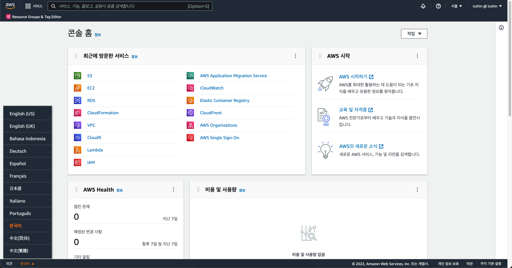
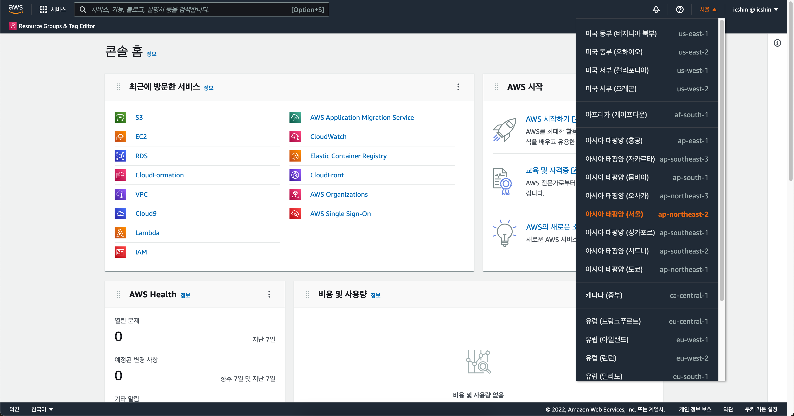

# 2-2. 추가 설정하기

AWS 관리 콘솔에 로그인하여 실습 환경을 준비합니다.

## 사전 준비사항

원활한 실습을 위해, AWS 관리 콘솔에 접속하여 아래 내용을 확인해 주세요.

1. [AWS 콘솔창](https://console.aws.amazon.com) 에 로그인하여 한국어로 언어를 설정하려면 아래와 같이 합니다. 실습 수행 중 생성하는 각각의 요소들의(VPC, NAT Gateway 및 EIP 등) 식별자(ID) 는 사용자 계정마다 다릅니다.

1. 서비스의 빠른 응답 속도를 위하여 가장 가까운 리전(Region) 을 선택하여 진행하기를 권장합니다.

모두 준비가 되셨나요? 이제 본격적인 실습을 진행해 보겠습니다.
