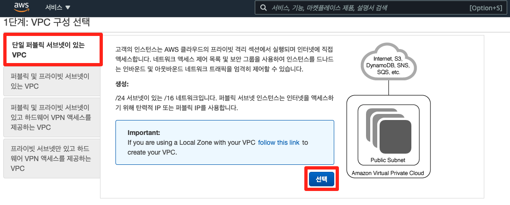
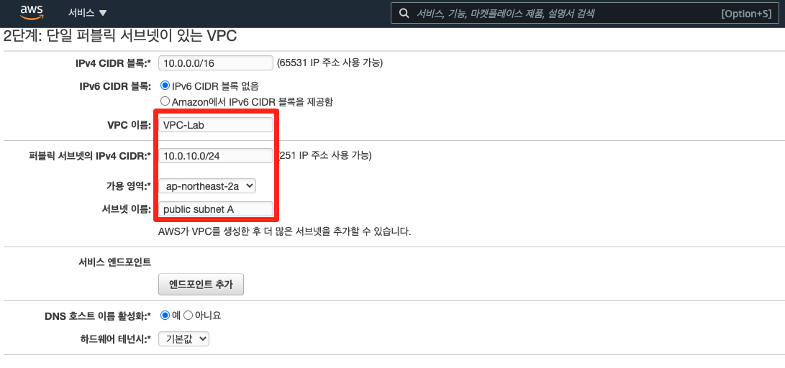
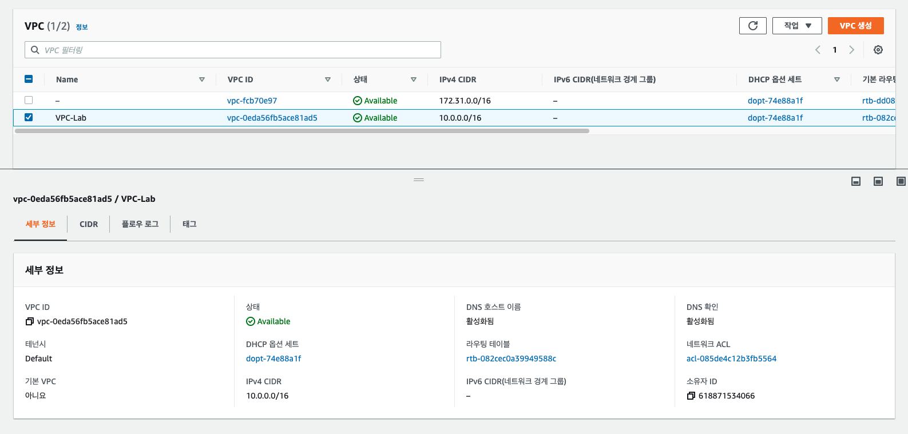
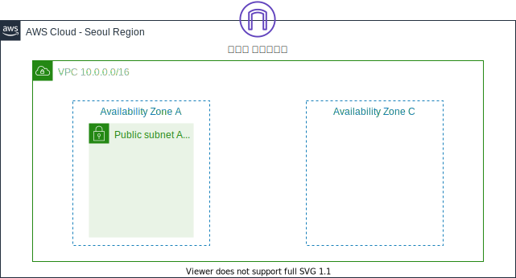

# 3. VPC 생성하기

## VPC 생성

1. [VPC 콘솔](https://console.aws.amazon.com/vpc/home?region=ap-northeast-2)에 로그인 합니다.

2. 아래의 화면에서 VPC 마법사 시작을 클릭하여 VPC 생성 마법사를 시작합니다. VPC 마법사를 사용하면 기본이 아닌 VPC 구성을 손쉽게 생성할 수 있습니다.

3. 단계 1: VPC 구성 선택에서 첫 번째 옵션인 단일 퍼블릭 서브넷이 있는 VPC를 선택합니다.

4. 서브넷을 만들 때 해당 서브넷에 대한 CIDR 블록을 지정합니다. 이는 VPC CIDR 블록의 부분 집합입니다. 각 서브넷은 단일 가용 영역 내에서만 존재해야 합니다. 단계 2: 단일 퍼블릭 서브넷이 있는 VPC에서 화면과 같이 값을 입력한 후, 우측 하단의 VPC 생성 버튼을 누릅니다.

키 | 값
-- | --
IPv4 CIDR 블록 | 10.0.0.0/16
VPC 이름 | VPC-Lab
퍼블릭 서브넷의 IPv4 CIDR | 10.0.10.0/24
가용 영역 | ap-northeast-2a
서브넷 이름 | public subnet A

VPC IPv4 CIDR 블록 값을 지정할 때에는 향후 직접 연결할 가능성이 있는 네트워크와 주소가 중복되지 않도록 할당하는 것이 중요합니다. 또한, 향후 확장을 고려하여 충분히 큰 주소를 할당합니다.

5. 생성이 완료되면 화면와 같이 VPC-Lab 이름을 가진 VPC가 생성된 것을 확인할 수 있습니다.

6. 현재까지의 아키텍처 구성은 아래와 같습니다.

## CIDR 주소 범위 이해하기
CIDR(Classless Inter-Domain Routing)은 네트워크의 주소와 크기를 표현하는 방식 중 하나입니다. 위의 실습에서 생성한 VPC는 16을 서브넷 값으로 하는 IP 주소 범위입니다. 각 자원에 줄 수 있는 IP 갯수는 2의 16승인 65,536개입니다.

VPC CIDR 블록을 지정할 때, 허용된 블록 크기는 /16 넷 마스크 (사용 가능한 IP 주소 65,536개)~ /28 넷 마스크(사용 가능한 IP 주소 16개)입니다. 각 서브넷 CIDR 블록에서 첫 4개의 IP 주소와 마지막 IP 주소는 사용자가 사용할 수 없으므로 인스턴스에 할당할 수 없습니다. 예를 들어 10.0.0.0/24 CIDR 블록의 서브넷에서는 다음 5개 IP 주소가 예약되어 있습니다.

키 | 값
-- | --
10.0.0.0 | 네트워크 주소
10.0.0.1 | AWS에서 VPC 라우터용으로 예약
10.0.0.2 | DNS 서버 주소
10.0.0.3 |AWS에서 나중에 사용하려고 예약
10.0.0.255 | 네트워크 브로드캐스트 주소

---

**다음** [3-2. 추가 서브넷 생성하기](./3-2.create-subnet.md) 