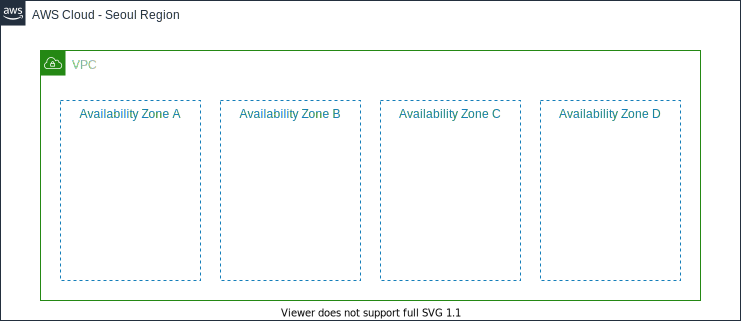

# 3. VPC 구성하기

## 네트워크 구성하기

### VPC(Virtual Private Cloud) 이해하기
[Amazon Virtual Private Cloud(Amazon VPC)](https://docs.aws.amazon.com/ko_kr/vpc/latest/userguide/what-is-amazon-vpc.html)를 이용하면 사용자가 정의한 가상의 네트워크 공간 안에서 AWS 리소스를 시작할 수 있습니다. 해당 가상 네트워크는 AWS의 확장 가능한 인프라를 사용한다는 이점과 함께 고객의 데이터 센터에서 운영하는 기존 네트워크와 매우 유사합니다.

아래의 순서 대로 실습을 진행하면서 네트워크를 직접 구성합니다.

[3-1. VPC 생성](./3-1.create-vpc.md) 
[3-2. 추가 서브넷 생성하기](./3-2.create-subnet.md) 
[3-3. 라우팅 테이블 편집하기](./3-3.set-route-table.md) 
[3-4. 보안 그룹 생성하기](./3-4.create-sg.md) 
[3-5. VPC 구성 요소들의 이해](./3-5.vpc-component.md) 
[3-6. 고급 개념들](./3-6.advanced-concepts.md) 

---

**다음** [3-1. VPC 생성](./3-1.create-vpc.md)