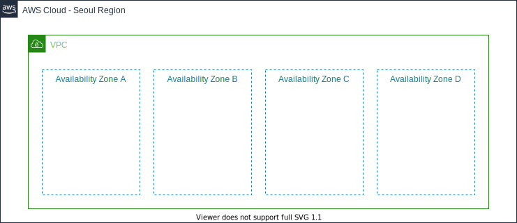

# 3. VPC 구성하기

## 네트워크 구성하기

### VPC(Virtual Private Cloud) 이해하기

[Amazon Virtual Private Cloud(Amazon VPC)](https://docs.aws.amazon.com/ko\_kr/vpc/latest/userguide/what-is-amazon-vpc.html)를 이용하면 사용자가 정의한 가상의 네트워크 공간 안에서 AWS 리소스를 시작할 수 있습니다. 해당 가상 네트워크는 AWS의 확장 가능한 인프라를 사용한다는 이점과 함께 고객의 데이터 센터에서 운영하는 기존 네트워크와 매우 유사합니다.

아래의 순서 대로 실습을 진행하면서 네트워크를 직접 구성합니다.

***

**다음** [3-1. VPC 생성](3-1.create-vpc.md)
