# 4-1. 웹 서버 인스턴스 생성하기

## 웹 서버 인스턴스 생성
인스턴스는 아래의 단계를 통해, 생성됩니다.

- AMI 선택
- 인스턴스 유형 선택
- 인스턴스 구성
- 스토리지 추가
- 태그 추가
- 보안 그룹 구성
- 검토

1. [EC2 콘솔](https://console.aws.amazon.com/ec2/home?region=ap-northeast-2)에 로그인 합니다.

2. 아래의 화면에서 인스턴스 시작을 클릭하여 인스턴스를 생성합니다.

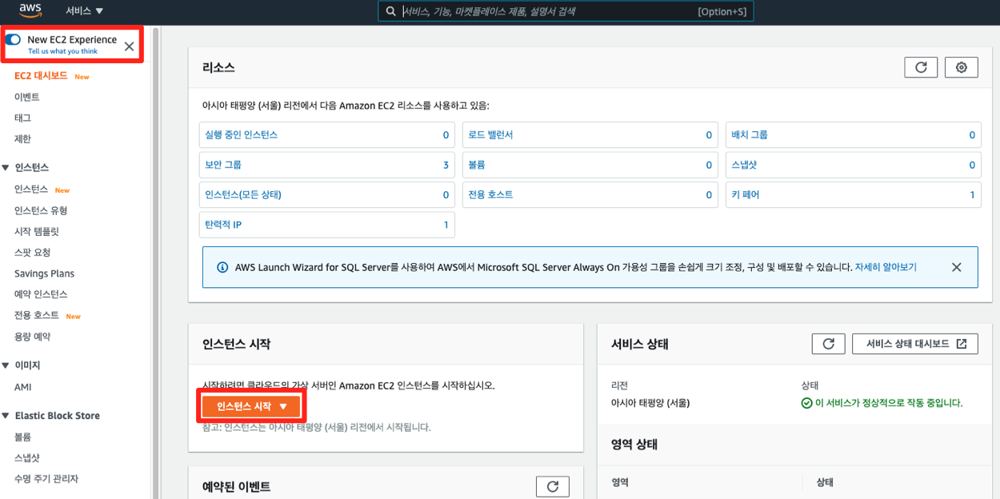

3. 단계 1: Amazon Machine Image(AMI) 선택에서 Amazon Linux 2 AMI를 선택합니다.

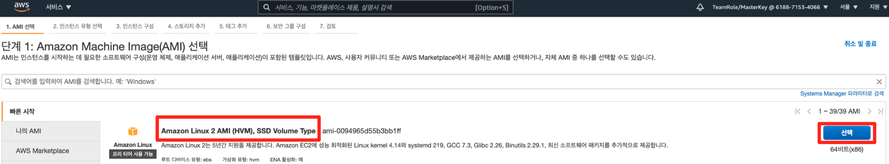

4. 단계 2: 인스턴스 유형 선택에서 t2.micro를 선택한 후, 다음: 인스턴스 세부 정보 구성 버튼을 클릭합니다.

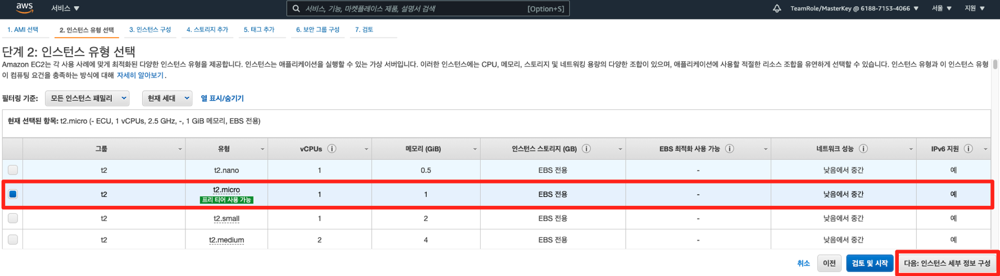

5. 단계 3: 인스턴스 세부 정보 구성에서 아래와 같이 값을 입력한 후, 스크롤을 내립니다.

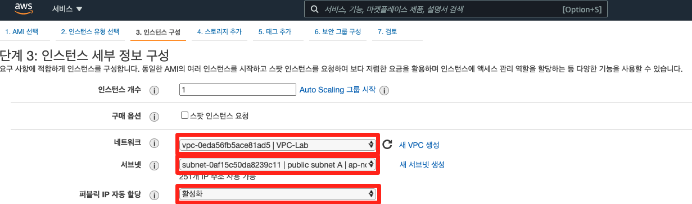

키 | 값
-- | --
네트워크 | VPC-Lab
서브넷 | public subnet A
퍼블릭 IP | 자동 할당	활성화

6. 아래에 있는 고급 세부 정보에서 사용자 데이터에 아래에 있는 값을 복사하여 붙여 넣습니다. 그 다음, 다음: 스토리지 추가 버튼을 클릭합니다. 이 때, 아래의 값을 정확히 입력하지 않으면 인스턴스 실행 후, 서비스가 제대로 올라오지 않을 수 있습니다. (방법 1 또는 방법 2 둘 중 하나만 사용)

방법 1. 쉘 스크립트가 기술된 URL을 입력

```
#include https://kr-id-general.workshop.aws/sh/start.sh
```

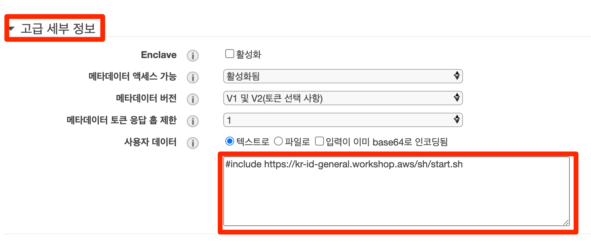

방법 2. 쉘 스크립트를 직접 입력

```
#!/bin/sh
yum -y install httpd php mysql php-mysql
chkconfig httpd on
systemctl start httpd
if [ ! -f /var/www/html/immersion-day-app.tar.gz ]; then
   cd /var/www/html
   wget https://kr-id-general.workshop.aws/sh/immersion-day-app.tar.gz
   tar xvfz immersion-day-app.tar.gz
   chown apache:root /var/www/html/rds.conf.php
fi
yum -y update
```

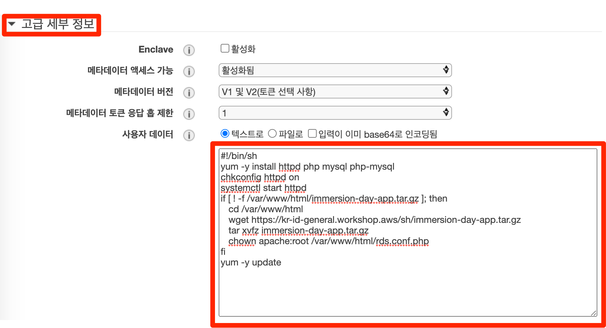

방법 1 또는 방법 2 둘 중 하나만 사용하시면 됩니다.

7. 단계 4: 스토리지 추가에서 다음: 태그 추가 버튼을 클릭합니다.

8. 단계 5: 태그 추가에서 아래와 같이 값을 입력합니다.

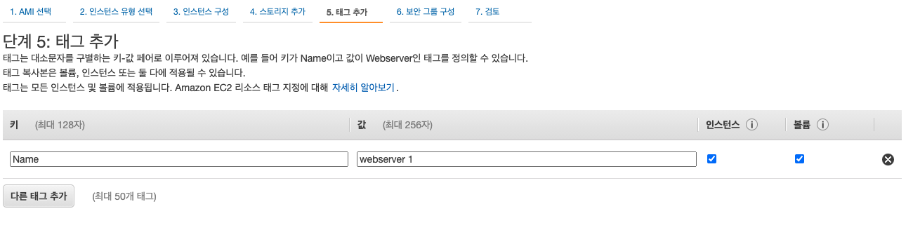

키 | 값
-- | --
Name | webserver 1

AWS 리소스에 태그 형태로 메타 데이터를 지정할 수 있습니다. 태그를 사용하면 리소스를 손쉽게 관리, 식별, 정리, 검색 및 필터링을 할 수 있습니다. 태그를 생성하여 용도, 소유자, 환경 또는 기타 기준으로 리소스를 분류할 수 있습니다.

9. 단계 6: 보안 그룹 구성에서 3-4 보안 그룹 생성하기에서 생성한 보안 그룹을 선택한 후, 검토 및 시작 버튼을 클릭합니다.

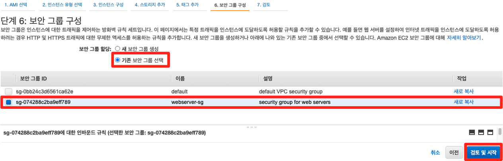

10. 단계 7: 인스턴스 시작 검토에서 우측 하단에 있는 시작하기 버튼을 클릭합니다. 본 실습에서는 키 페어를 필요로 하지 않지만 향후 SSH 클라이언트로 접속할 경우 키 페어가 필요할 수 있습니다. 키 페어 생성 및 다운로드가 되면 인스턴스 시작 버튼을 클릭하여 인스턴스를 구동합니다.

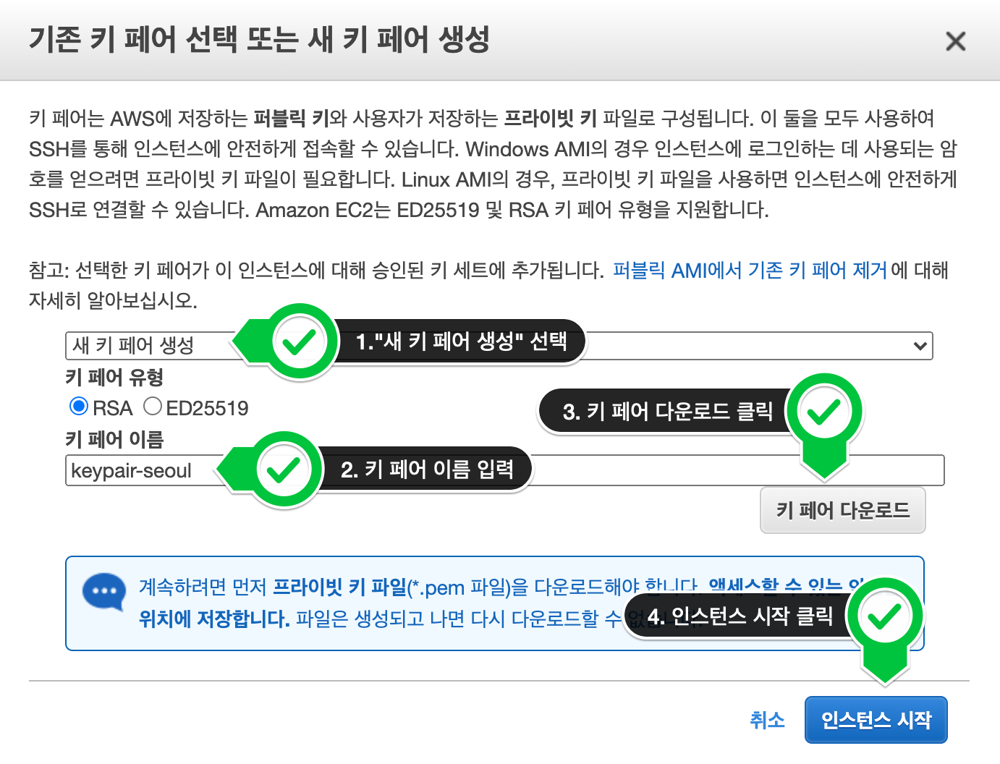

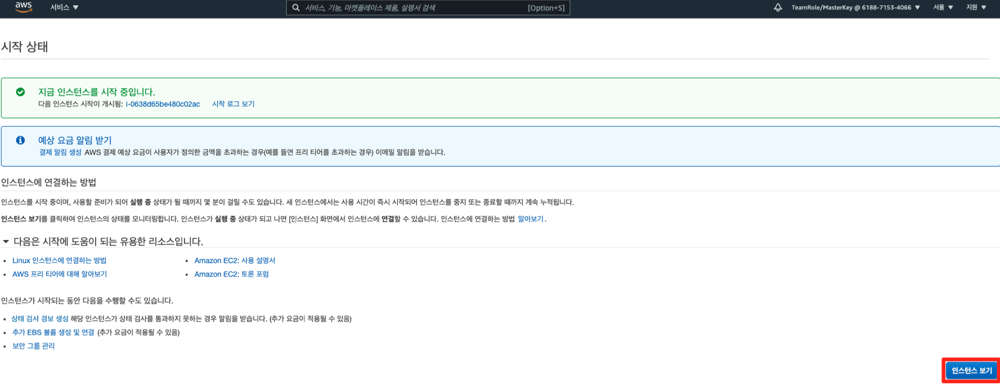

11. 인스턴스 보기를 클릭하면 아래와 같은 화면을 볼 수 있습니다.

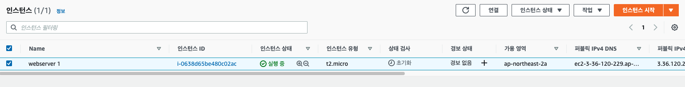

[!] 방금 생성한 인스턴스를 클릭하면 하단에 세부 정보 탭에서 인스턴스의 속성을 확인할 수 있습니다.

12. 상태 검사 속성이 초기화에서 2/2 검사 통과로 바뀌면 인스턴스를 클릭한 상태에서 우측 상단의 연결 버튼을 클릭합니다.

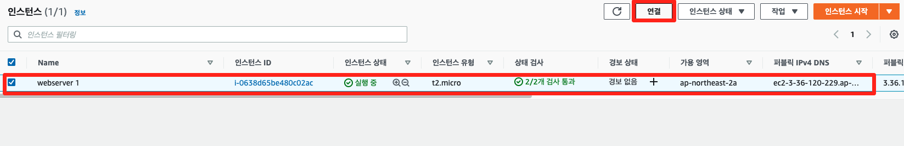

13. 아래의 화면에서 연결 버튼을 누릅니다.

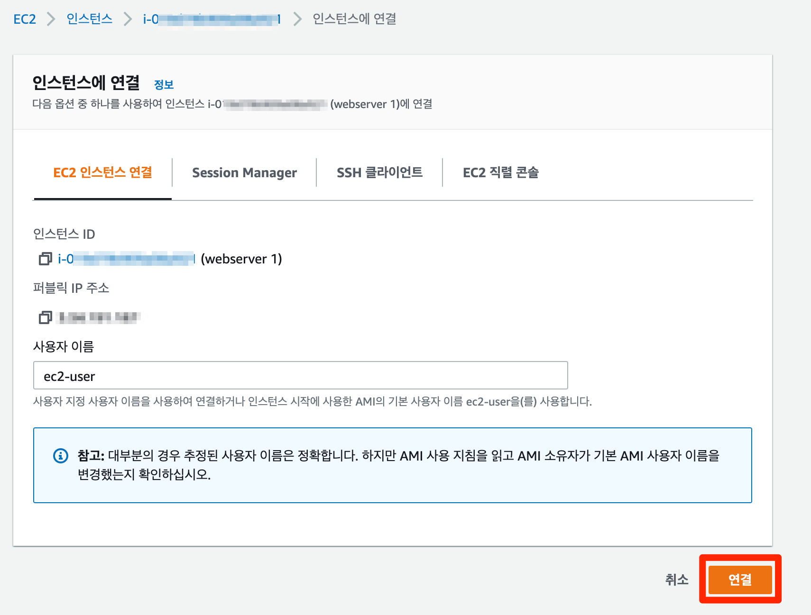

14. 웹 화면 상에서 터미널에 접속된 것을 확인할 수 있습니다.

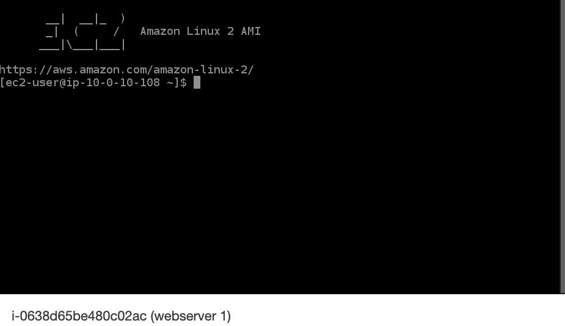

[!] 만약 터미널에 접속 되지 않는다면 브라우저 확인 및 시크릿 모드인지 확인하십시오.

15. 다시 인스턴스 화면으로 돌아와 생성한 인스턴스를 클릭한 후, 세부 정보에서 IPv4 퍼블릭 IP 값을 복사한 후, 웹 브라우저에 붙여 넣습니다.

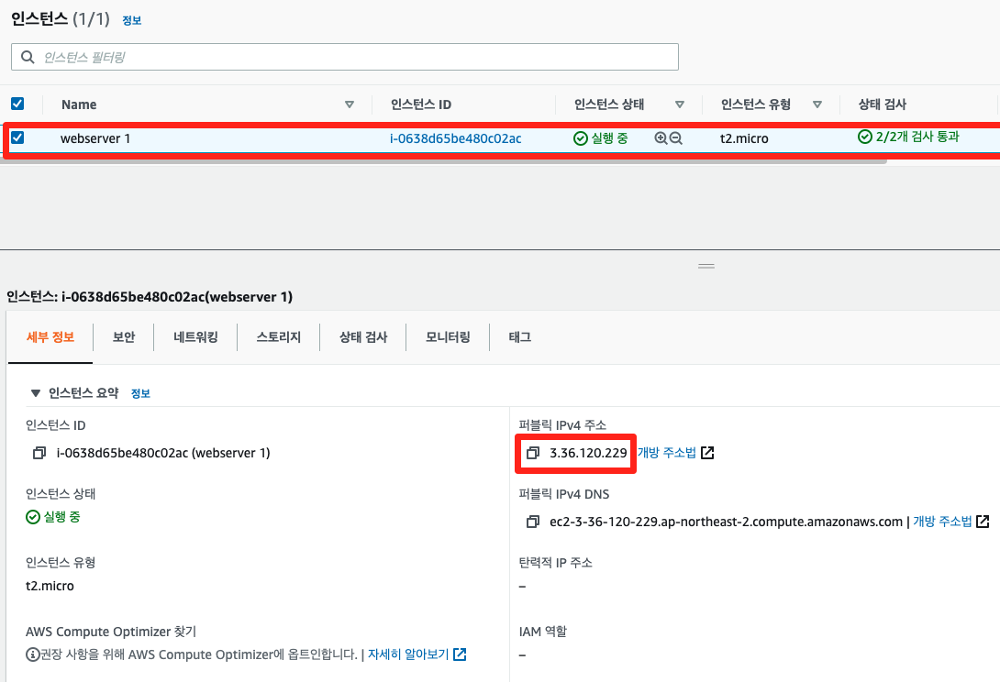

웹 브라우저에 퍼블릭 IP 붙여넣기 시, 반드시 http://퍼블릭_IP (예시: http://3.36.120.229) 형태로 붙여넣기가 된것을 확인해주세요. (https://퍼블릭_IP는 접근이 안됩니다.)

16. 아래와 같은 웹 화면을 확인할 수 있습니다.

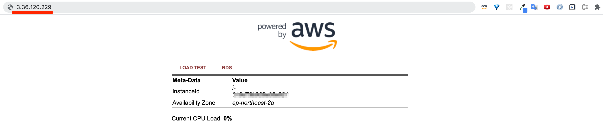

현재까지의 아키텍처 구성은 아래와 같습니다.


---

**다음** [2. 키 페어 생성](./1-2.keypair.md)<br>