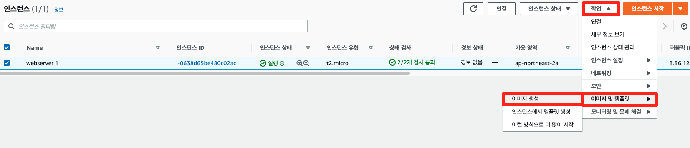
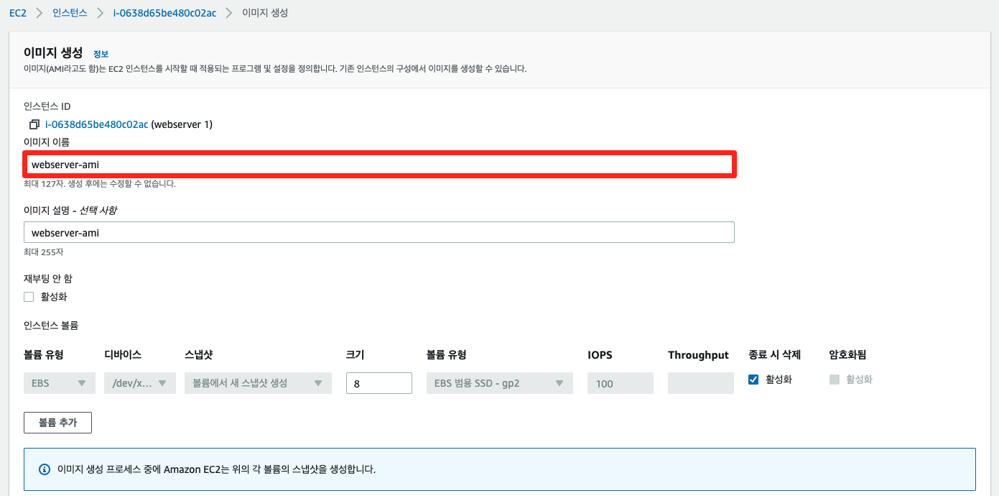
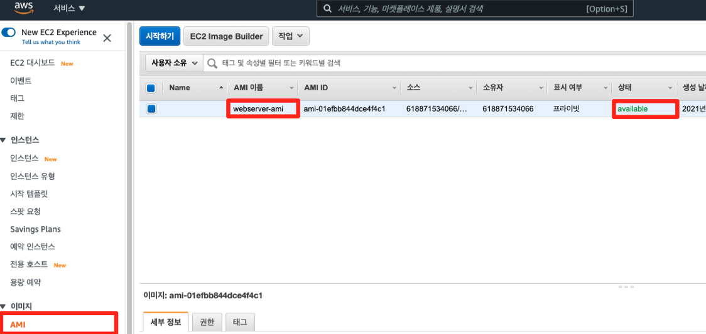

# 4-2. AMI 생성하기

## AMI 개념

Amazon Machine Image(AMI)는 인스턴스를 시작하는데 필요한 정보를 제공합니다. 인스턴스를 시작할 때, AMI를 지정해야하는데, 동일한 구성의 인스턴스가 여러 개 필요할 때는 한 AMI를 사용하여 여러 인스턴스를 시작할 수 있습니다. 본 실습에서는 4-1 웹 서버 인스턴스 생성하기에서 생성한 인스턴스의 이미지를 뜨는 작업을 수행합니다.

## AMI 생성

1. 앞서 생성한 인스턴스를 클릭한 후, 작업 메뉴에서 이미지 및 템플릿 클릭, 이미지 생성을 클릭합니다.

1. 이미지 생성 페이지에서 아래와 같이 값(webserver-ami)을 입력한 후, 우측 하단의 이미지 생성 버튼을 클릭합니다.

1. 왼쪽 사이드 바에서 AMI 메뉴를 클릭한 후, 방금 생성한 이미지를 확인합니다. 해당 이미지의 상태가 available로 변경될 때까지 대기합니다.

1. 현재까지의 아키텍처 구성은 아래와 같습니다.

