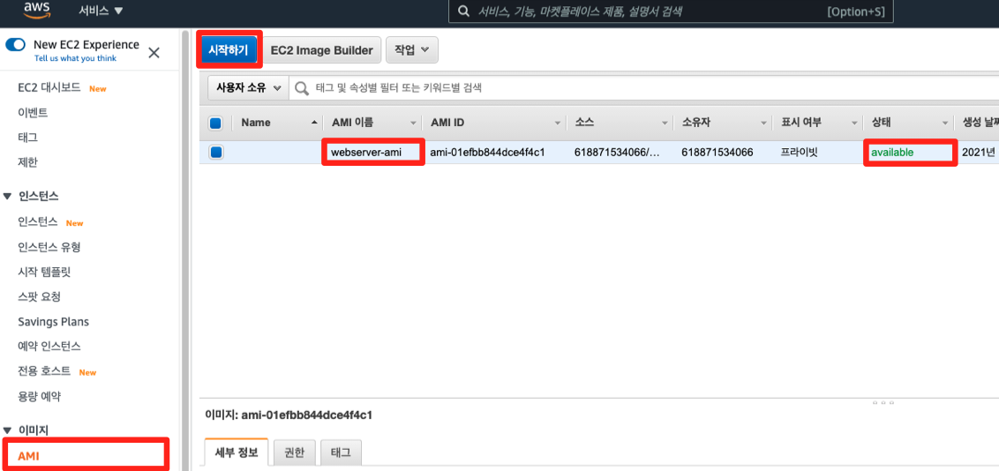
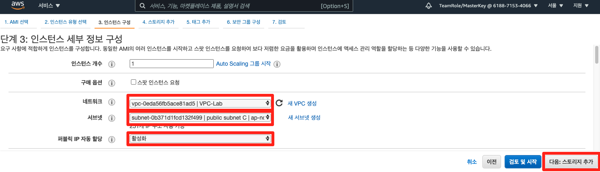
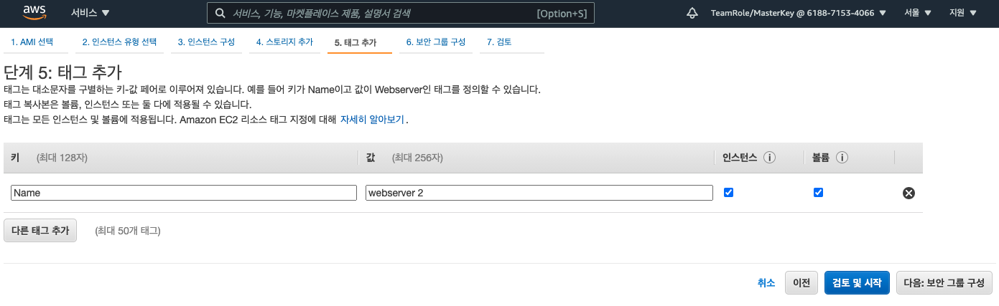
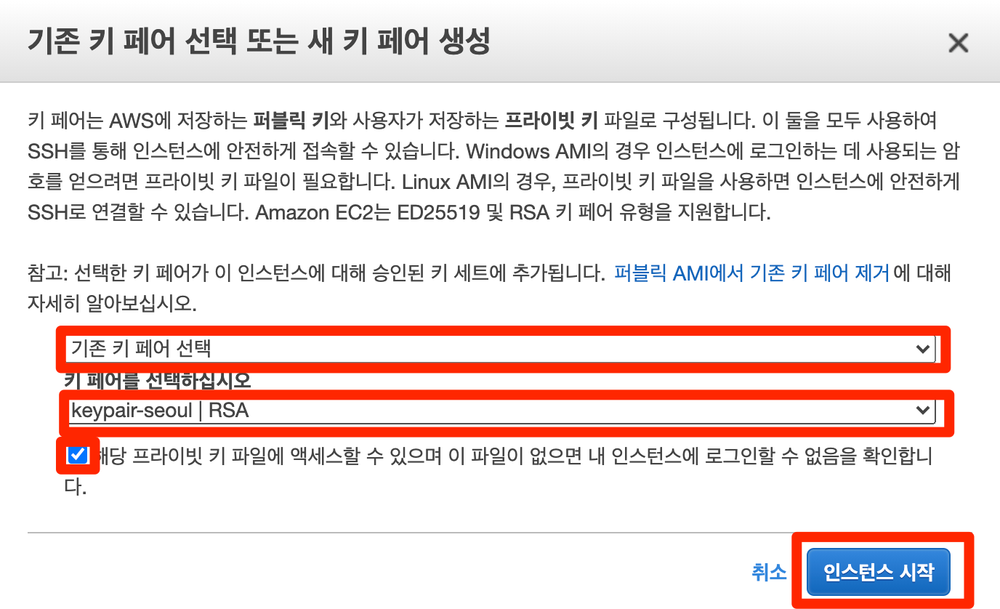
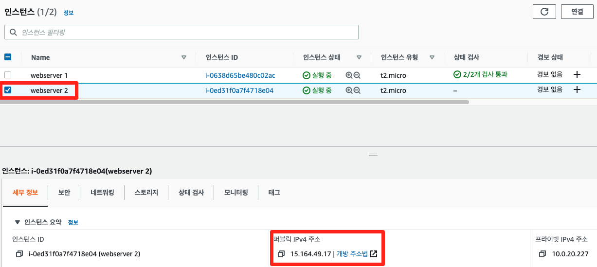
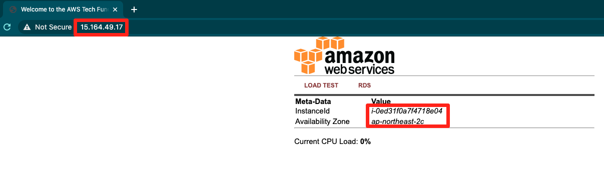

# 4-3. AMI 기반 인스턴스 생성하기

## AMI 기반 인스턴스 생성

1. AMI 메뉴에서 상태 변경이 완료되면 시작하기 버튼을 클릭합니다.

1. 단계 3: 인스턴스 세부 정보 구성에서 아래와 같이 값을 입력한 후, 다음: 스토리지 추가 버튼을 클릭합니다.

| 키            | 값               |
| ------------ | --------------- |
| 네트워크         | VPC-Lab         |
| 서브넷          | public subnet C |
| 퍼블릭 IP 자동 할당 | 활성화             |

1. 단계 4에서 다음으로 넘어가 단계 5: 태그 추가에서 아래와 같이 값을 입력합니다.

| 키    | 값           |
| ---- | ----------- |
| Name | webserver 2 |

1. 단계 6: 보안 그룹 구성에서 앞선 페이지에서와 마찬 가지로 기존 보안 그룹 선택을 클릭한 후, 이름이 webserver-sg인 보안 그룹을 선택하고 검토 및 시작 버튼을 클릭합니다.

.png)

1. 단계 7: 인스턴스 시작 검토에서 우측 하단에 있는 시작하기 버튼을 클릭합니다. 화면과 같이 앞서 생성한 키 페어를 선택한 후, 인스턴스 시작 버튼을 클릭하여 인스턴스를 구동합니다.

1. 왼쪽 사이드 바에서 인스턴스 메뉴를 클릭한 후, 방금 생성된 webserver 2의 퍼블릭 IPv4 주소를 복사한 후, 웹 브라우저에 붙여 넣습니다.

1. 아래와 같은 웹 화면을 확인할 수 있습니다.

1. 현재까지의 아키텍처 구성은 아래와 같습니다.

