# 로드밸런서 생성하기

## 로드밸런서 생성
본 실습에서는 Application Load Balancer를 사용합니다.

1. 왼쪽 사이드 바에서 로드 밸런서 메뉴를 클릭한 후, Load Balancer 생성 버튼을 클릭합니다.

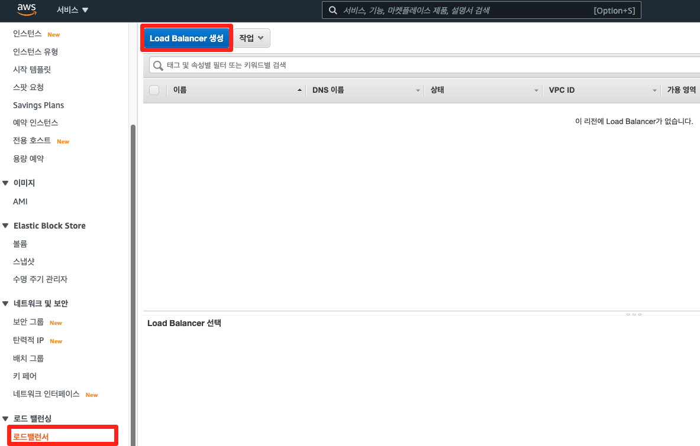

2. Load Balancer 유형 선택에서 Application Load Balancer를 선택합니다.

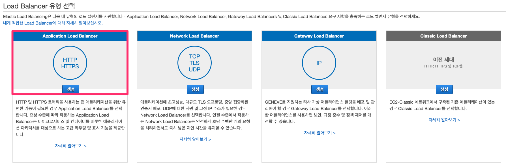

3. 단계 1: Load Balancer 구성에서 아래와 같이 값을 입력한 후, 스크롤을 내립니다.

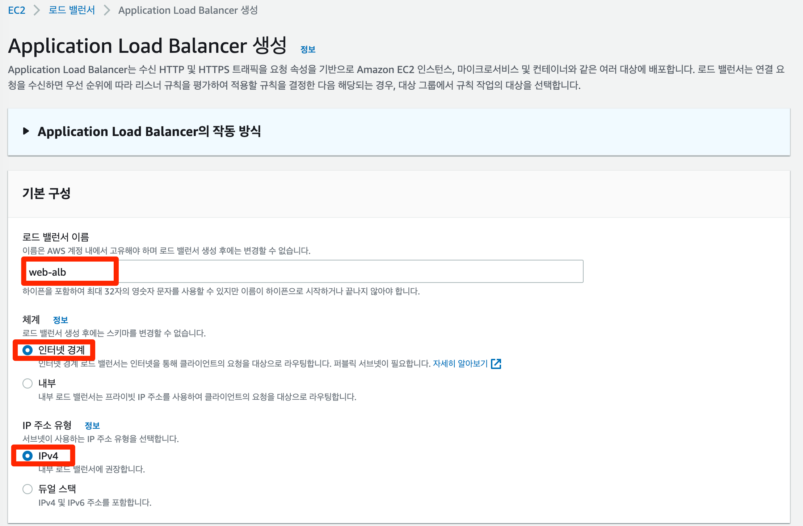

키 | 값
-- | --
이름 | web-alb

4. 가용 영역에서 앞서 생성한 VPC-Lab을 선택한 후, 가용 영역에서 public subnet A와 public subnet C를 선택합니다. 해당 작업은 로드밸런서에서 트래픽을 라우팅할 VPC와 가용 영역을 지정하는 작업입니다. 설정이 완료되면 아래 보안 그룹으로 스크롤을 내립니다.

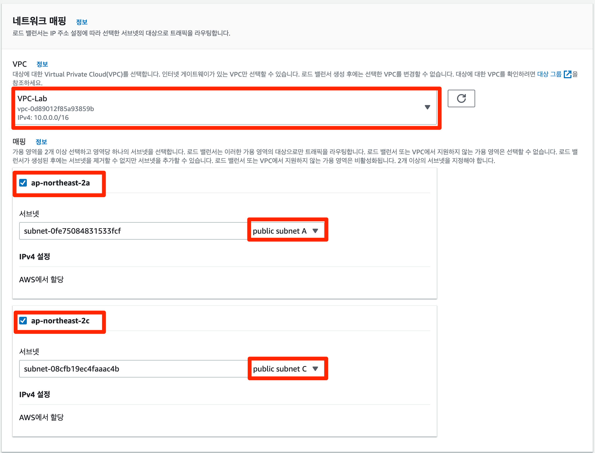

키 | 값
-- | --
VPC | VPC-Lab
매핑 | ap-northeast-2a, ap-northeast-2c 선택
서브넷 | public subnet A, public subnet C 선택

5. 보안 그룹에서 Default 보안 그룹을 삭제하고 새 보안 그룹 생성 버튼을 클릭합니다.

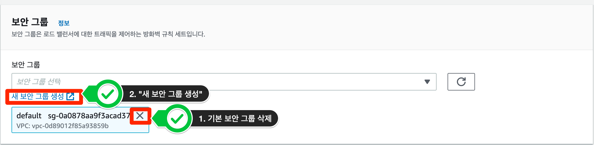

6. 보안 그룹 생성창에서 보안 그룹 이름에는 webalb-sg 입력 그리고 규칙에는 HTTP 클릭 Anywhere-IPv4 선택 후, 보안 그룹 생성 버튼을 클릭합니다.

키 | 값
-- | --
보안 그룹 이름 | webalb-sg
설명 | security group for load balancer
VPC | VPC-Lab
유형 | HTTP
소스 | Anywhere-IPv4

7. 다시 로드 밸런서 생성하기로 돌아와서 방금 생성한 webalb-sg 보안 그룹을 선택합니다.

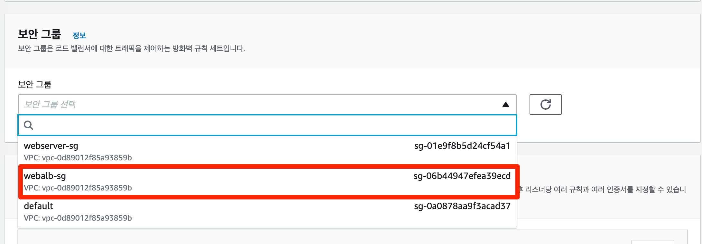

8. 스크롤를 내리고 리스너 및 라우팅에서 프로토콜과 포트는 기본값으로 두고 대상 그룹 생성 버튼을 클릭합니다.

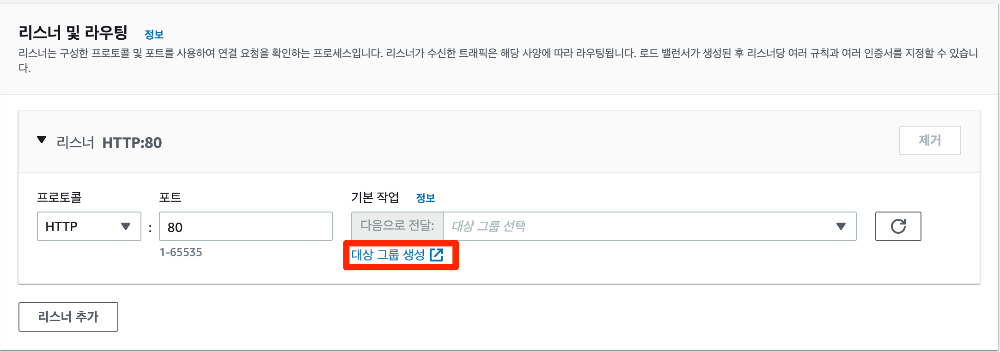

리스너는 연결 요청을 확인하는 프로세스입니다. 리스너는 프로토콜 및 포트로 구성되며 로드밸런서의 앞단과 뒷단을 연결하는 역할을 합니다.

9. 그룹 세부 정보 지정 창이 뜨고 아래와 같이 값을 입력하고 다음 버튼을 클릭합니다.

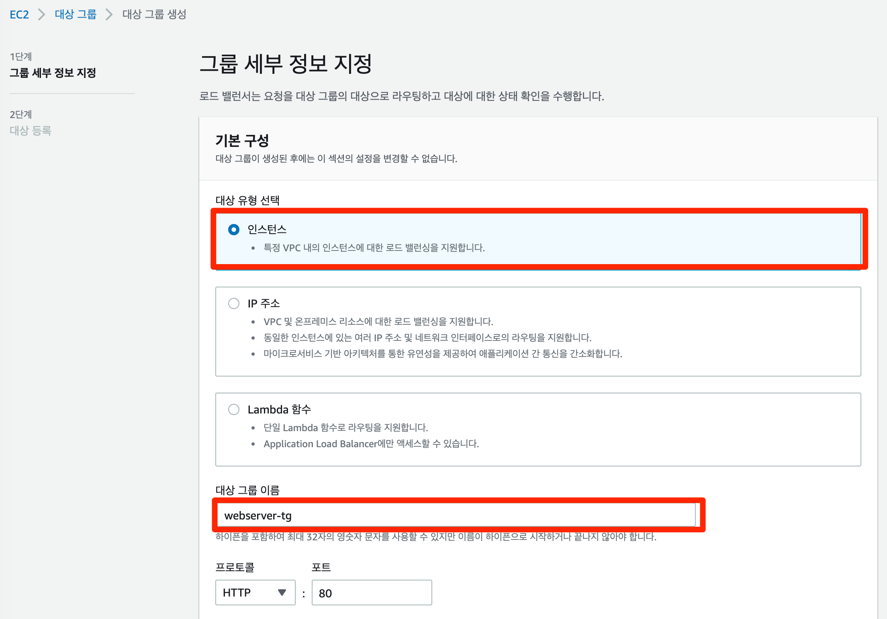

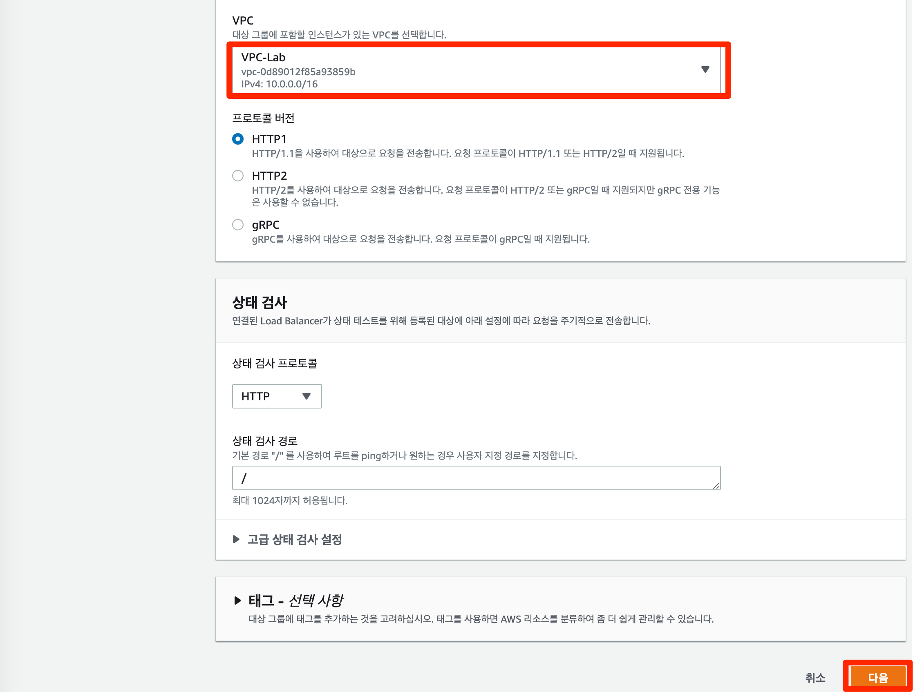

키 | 값
-- | --
대상 인스턴스 유형 | 인스턴스
대상 그룹 이름 | webserver-tg
VPC | VPC-Lab

라우팅 구성 단계 마지막 부분에 있는 고급 상태 검사 설정 각각의 값들이 의미하는 바는 아래와 같습니다.

키 | 값
-- | --
정상/비정상 임계 값 | 정상/비정상을 결정하기 위한 연속된 실패/성공 확인 횟수
제한 시간 | 상태 확인 응답 대기 시간
간격 | 인스턴스 상태 확인 간격
성공 코드 | 응답 성공 확인시 받을 HTTP 코드

10. 다음 대상 등록 창에서 webserver 1과 webserver 2를 선택하고 아래에 보류 중인 것으로 포함 버튼을 클릭합니다.

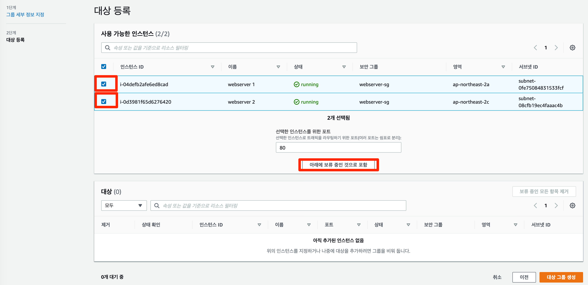

11. webserver 1과 webserver 2가 아래와 같이 대상에 등록이 된 것을 확인하실 수 있습니다. 대상 그룹 생성 버튼을 클릭합니다.

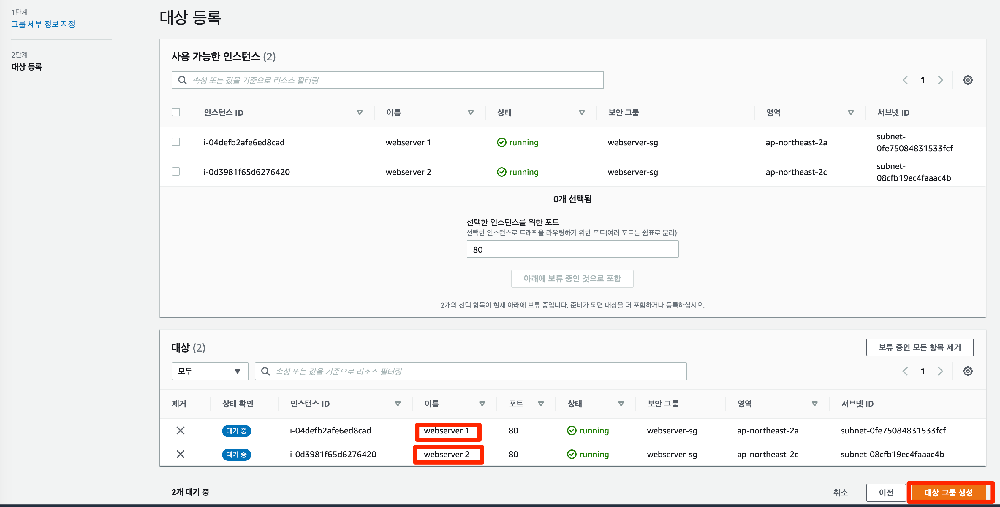

12. 다시 로드 밸런서 생성하기 창으로 돌아가 리스너 및 라우팅의 기본 작업에서 새로고침 버튼을 누르고 생성한 대상 그룹 webserver-tg을 선택합니다.

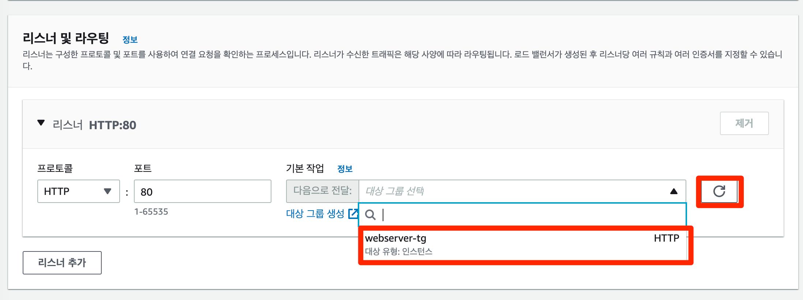

13. 스크롤을 쭉 내린 다음 로드 밸런서 생성 버튼을 클릭합니다.

14. 로드 밸런서가 정상적으로 생성되는 것을 확인할 수 있습니다. 몇 분의 시간이 소요될 수 있습니다. 로드 밸런서 보기 버튼을 클릭하여 생성된 로드 밸런서를 확인합니다.

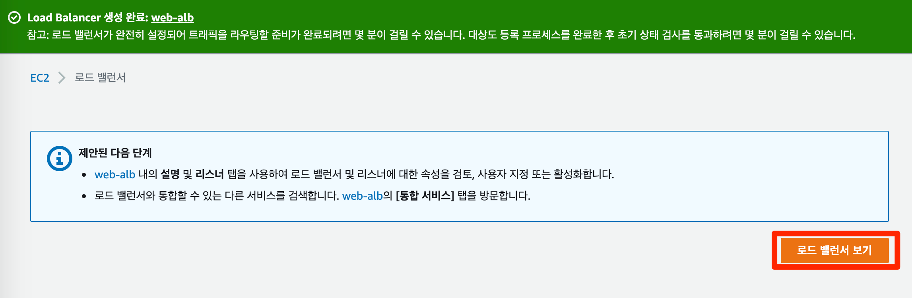

15. 로드밸런서를 통하여 웹 애플리케이션에 접근하기 이전, 챕터 4에서 생성하였던 웹 서버가 로드 밸런서의 트래픽만 받게 하기 위하여 보안 그룹 인바운드 규칙 편집 작업을 수행합니다. 보안 그룹 메뉴에서 webserver-sg 보안 그룹을 선택 후, 인바운드 규칙 편집을 클릭합니다.

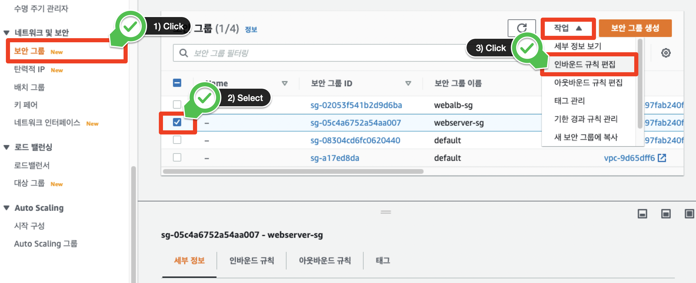

기존에 구성되어 있는 HTTP 유형의 인바운드 규칙을 제거합니다

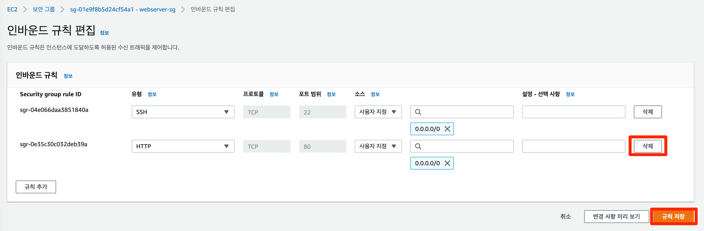

16. 새로운 HTTP 유형 인바운드 규칙을 다시 추가하고, 인바운드 규칙에서 로드밸런서의 트래픽만 받을 수 있도록 소스 부분에서 사용자 지정 클릭 후, webalb-sg를 지정합니다. 오른쪽 하단에 있는 규칙 저장 버튼을 누릅니다.

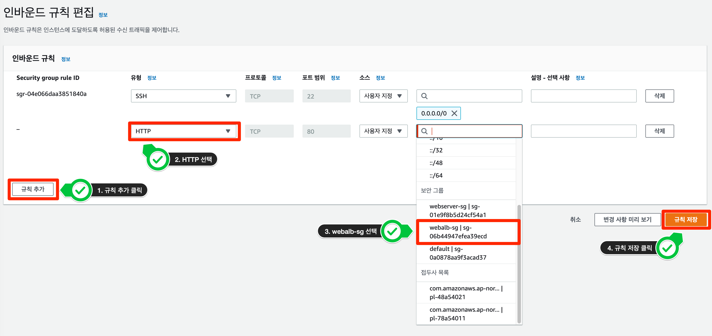

17. 다시 로드 밸런서 메뉴로 들어와 방금 생성한 로드밸런서의 상태를 확인한 후, 활성 상태가 되면 아래의 설명에서 DNS 이름을 복사하여 웹 브라우저에 붙여 넣습니다. (참고: DNS 이름을 웹 브라우저로 복사 붙여넣기 후 연결이 안될 시 http://“DNS 이름"로 연결 되었는지 확인하시기 바랍니다. 본 실습에서는 HTTP 인바운드 규칙을 허용해놨습니다.)

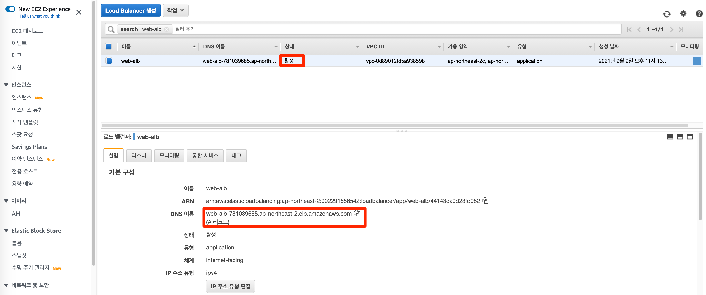

18. 아래와 같은 웹 화면을 확인할 수 있습니다.

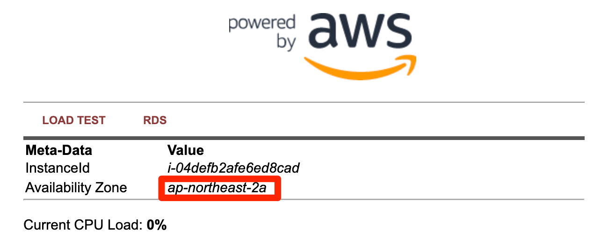

19. 웹 화면 새로 고침을 클릭하면 Application Load Balancer에서 기본으로 제공하는 라운드 로빈 알고리즘에 따라 화면에 보이는 InstanceID, Availabilty Zone 값이 변경되는 것을 확인할 수 있습니다.

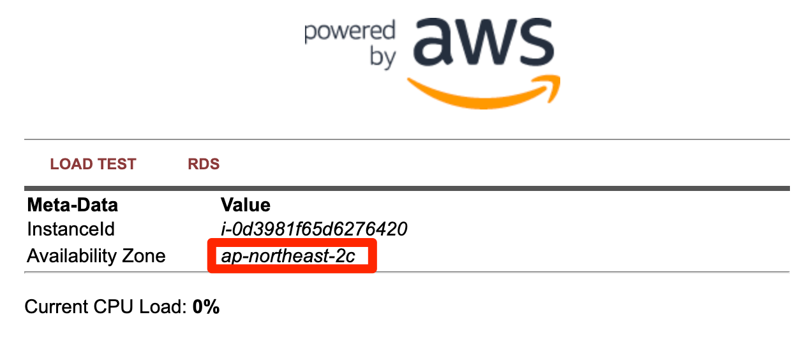

현재까지의 아키텍처 구성은 아래와 같습니다.

.svg)

## 로드밸런서 대상 상태 확인
1. 왼쪽 사이드 바에서 대상 그룹 메뉴를 클릭한 후, 로드밸런서 생성 단계에서 만든 대상 그룹을 선택합니다.

.png)

2. 세부 페이지에서 대상 탭을 클릭하면 로드밸런서에 등록된 인스턴스들의 상태를 확인할 수 있습니다.

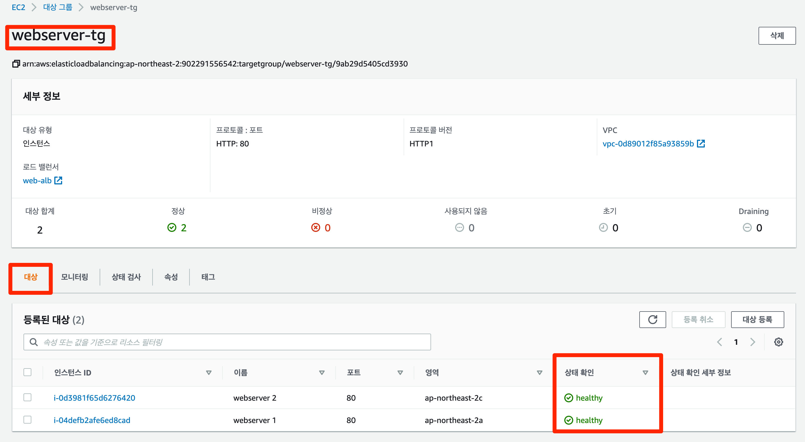

---

[처음](/workshop13-awsbuilders100/README.md) 