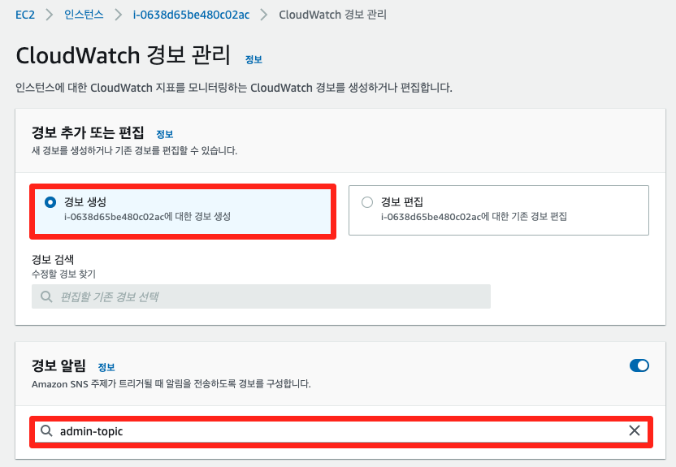

# 6-1. 모니터링

## Amazon SNS 개념

[Amazon SNS(Simple Notification Service)](https://aws.amazon.com/ko/sns/?whats-new-cards.sort-by=item.additionalFields.postDateTime&whats-new-cards.sort-order=desc)는 애플리케이션 간 혹은 애플리케이션과 사용자 간 통신 모두를 위한 완전관리형 메세징 서비스입니다. Amazon SNS 주제를 사용하면 게시자 시스템에서 병렬 처리를 위해 Amazon SQS 대기열, AWS Lambda 함수, HTTPS 엔드포인트를 비롯한 많은 구독자 시스템으로 메시지를 팬아웃할 수 있습니다.

## Amazon CloudWatch 개념

[Amazon CloudWatch](https://aws.amazon.com/ko/cloudwatch/)는 모니터링 및 관찰 기능 서비스입니다. CloudWatch는 애플리케이션을 모니터링하고, 시스템 전반의 성능 변경 사항에 대응하며, 리소스 사용률을 최적화하고, 운영 상태에 대한 통합된 보기를 확보하는데 필요한 데이터와 실행 가능한 통찰력을 제공합니다. CloudWatch는 로그, 지표 및 이벤트 형태로 모니터링 및 운영 데이터를 수집하여 AWS와 온프레미스 서버에서 실행되는 AWS 리소스, 애플리케이션 및 서비스에 대한 통합된 보기를 제공합니다. CloudWatch를 사용하여 환경에서 이상 동작을 감지하며, 경보를 설정하고, 로그와 지표를 나란히 시각화하며, 자동화된 작업을 수행하고, 문제를 해결하며, 통찰력을 확보하여 애플리케이션을 원활하게 실행할 수 있습니다.

본 실습은 아래의 단계로 수행됩니다.

Amazon SNS 설정

* 주제 생성 주제: 통신 채널 역할을 하는 논리적 액세스 포인트
* 구독자 생성 구독자: 해당 주체에 알람 발생 시, 해당 내용을 받는 주체

인스턴스 경보 생성

* 경보가 생성되는 기준 설정
* 알람 받을 대상 지정

## 모니터링 시스템 구축

1. 먼저, 알람 받을 대상을 지정하기 위해 SNS 콘솔에 로그인 합니다. 아래의 화면과 같이 admin-topic 값을 주제 이름에 입력한 후, 다음 단계 버튼을 클릭합니다.

2. 주제 생성 페이지에서 유형은 표준으로 이름은 admin-topic 값이 맞는지 확인한 후, 오른쪽 하단의 주제 생성 버튼을 클릭합니다.

3. 해당 주제로 알람이 발생 시, 받을 주체를 생성하기 위해 구독 생성 버튼을 클릭합니다.

4. 프로토콜은 이메일을 선택하고 엔드포인트는 알람을 수신할 이메일을 입력합니다. 실제로 이메일을 받을 수 있는 이메일 주소를 입력한 후, 구독 생성 버튼을 클릭합니다.

5. 방금 입력한 이메일 주소로 발송된 구독 확인 메일에서 확인 버튼(confirm subscription) 을 누르면 알림을 받을 수 있습니다.

6. [EC2 콘솔](https://console.aws.amazon.com/ec2/home?region=ap-northeast-2) 인스턴스 메뉴로 들어가 webserver 1 인스턴스를 클릭한 후, 작업 선택, 모니터링 및 문제 해결 선택, CloudWatch 경보 관리를 클릭합니다.

7. CloudWatch 경보 관리 페이지에서 경보 알림에 앞서 생성한 SNS 주제(admin-topic) 를 선택한 후, 스크롤을 내립니다.

8. 경보 임계값에서 type of data to sample에서 CPU 사용률을 선택하고 임계값은 30으로 지정한 후, 생성 버튼을 클릭합니다.

9. 로드 밸런서 DNS 이름을 복사하여 웹 브라우저에 붙여 넣습니다. 아래의 화면에서 LOAD TEST 버튼을 클릭하면 해당 인스턴스에 부하를 발생시킵니다.

10. 부하가 발생하면서 지정한 임계값을 넘으면 앞서 설정한 이메일로 아래와 같은 이메일이 수신됩니다.

