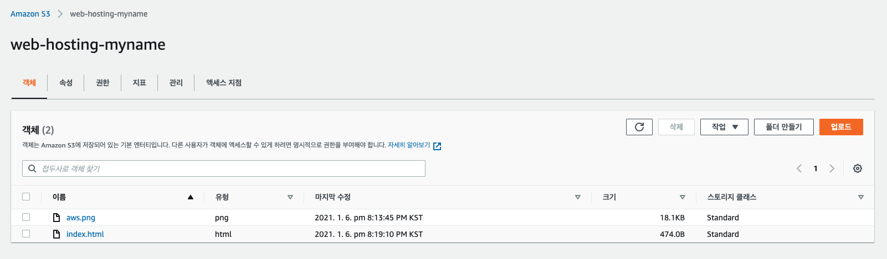
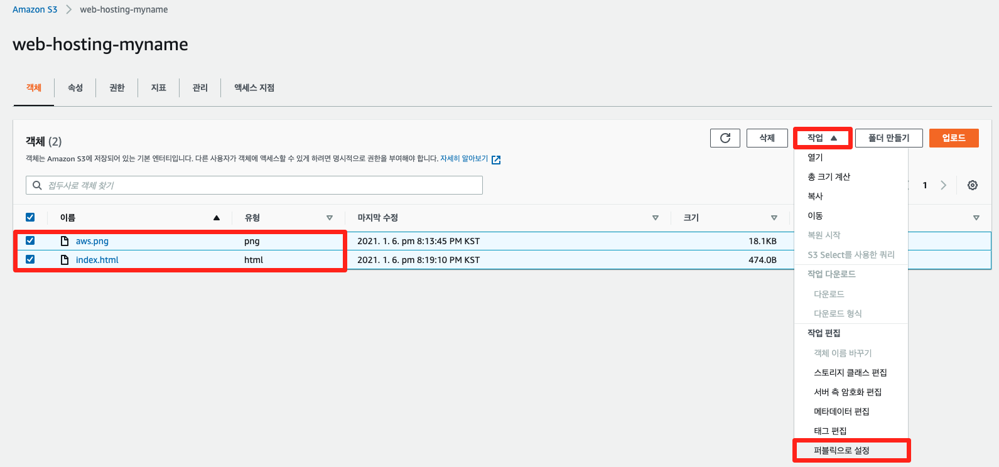

# 정적 웹 사이트 호스팅

## Amazon S3 개념

<p align="center"></p>

[Amazon S3(Simple Storage Service)](https://aws.amazon.com/ko/s3/)는 업계 최고의 확장성, 데이터 가용성 및 보안과 성능을 제공하는 객체 스토리지 서비스입니다. 즉, 규모와 업종에 상관없이 고객이 이 서비스를 이용하여 데이터 레이크, 웹사이트, 모바일 애플리케이션, 백업 및 복원, 아카이브, 엔터프라이즈 애플리케이션, IoT 디바이스, 빅 데이터 분석과 같은 다양한 사용 사례에서 원하는 만큼의 데이터를 저장하고 보호할 수 있습니다. Amazon S3는 사용하기 쉬운 관리 기능을 제공하므로 특정 비즈니스, 조직 및 규정 준수 요구 사항에 따라 데이터를 조직화하고 세부적인 액세스 제어를 구성할 수 있습니다. Amazon S3는 99.999999999%의 내구성을 제공하도록 설계되었으며, 전 세계 기업의 수백만 애플리케이션을 위해 데이터를 저장합니다.

본 실습에서는 Amazon S3에 데이터를 저장하고 정적 웹 사이트를 호스팅하는 방법에 대해 학습합니다.

## S3에 데이터 저장

1. S3 콘솔에 로그인한 후, 버켓 메뉴에서 버켓 만들기 버튼을 클릭합니다.


2. 버킷 이름 필드에 고유한 버킷 이름을 입력하세요. 본 실습에서는 web-hosting-실습사용자이름으로 입력하여 진행합니다. 입력한 버킷 이름은 Amazon S3 내에 중복될 수 없고 유일해야 합니다. 조직 이름 또는 사용자 이름 등을 반영하여 유일한 버킷을 생성하세요. 리전 드롭 다운 박스에서 버킷을 생성할 리전을 아시아 태평양(서울) ap-northeast-2로 선택합니다. 다른 속성은 기본 값으로 사용하고 버킷 만들기 버튼을 클릭합니다.


3. [이미지 파일](https://github-connection.s3.ap-northeast-2.amazonaws.com/immersion-day/aws.png) 을 다운로드(오픈 후 우클릭)하여 aws.png 로 저장 합니다.

4. 메모장 혹은 IDE 툴에서 아래의 소스 코드를 이용하여 index.html 이름으로 저장합니다.

```
<html>
    <head>
        <meta charset="utf-8">
        <title> S3 Web Hosting Page </title>
    </head>
    <body>
        <center>
        <br>
        <h2> Click image to be redirected to the EC2 instance that you created </h2>
        
        </center>
    </body>
</html>
```

5. 버킷 메뉴에서 방금 생성한 버킷을 선택합니다.


6. 버킷에 데이터를 담기 위해 업로드 버튼을 클릭합니다.


7. 파일 추가 버튼을 클릭하여 다운로드 받은 이미지 파일을 선택한 후, 업로드 버튼을 클릭합니다.


오브젝트 속성에서 객체 URL을 복사합니다.


8. 앞서 작성한 index.html 파일의 값을 아래와 같이 수정합니다. 이미지 링크 부분에는 방금 복사한 객체 URL 값을 넣고 클릭시 리다이렉트되는 위치는 5-1 로드밸런서 생성하기에서 만든 로드밸런서의 DNS 이름 값을 넣은 후 저장합니다.


9. aws.png 파일을 업로드한 방식과 마찬가지로 실습에서 생성한 S3 버킷에 방금 작성한 index.html 파일을 업로드합니다.


아래의 화면과 같이 S3 버킷에 두 개의 객체가 업로드된 것을 확인할 수 있습니다.



10. S3 버킷은 기본적으로 퍼블릭 액세스가 차단되어 있습니다. 권한 탭을 클릭하여 퍼블릭 액세스 차단 설정을 해제하는 작업을 수행합니다.


체크 박스를 해제한 후, 변경 사항을 저장합니다.


11. 그 다음, 앞서 업로드한 객체를 퍼블릭으로 설정하는 작업을 수행합니다. 해당 작업을 통해, 각 객체를 퍼블릭하게 접근할 수 있습니다.




## S3 버킷에 정적 웹 사이트 호스팅 기능 사용

1. S3 버킷 속성 탭을 클릭하고 스크롤을 내립니다.


정적 웹 사이트 호스팅 편집 버튼을 클릭합니다.


2. 활성화 라디오 버튼을 클릭함으로써 해당 버킷을 사용하여 웹 사이트를 호스팅하는 기능이 추가됩니다. 인덱스 문서 및 오류 문서에 index.html을 입력한 후, 변경 사항을 저장합니다.


3. 다시 속성 탭에서 버킷 웹 사이트 엔드포인트 값을 복사한 후, 웹 브라우저에 붙여넣습니다. 해당 엔드포인트를 통해, S3 정적 웹 사이트에 접속할 수 있습니다.


4. 웹 브라우저에서 아래와 같은 화면을 확인할 수 있습니다.


5. AWS 이미지를 클릭하면 앞서 생성한 웹 서버의 화면으로 리다이렉트되는 것을 확인할 수 있습니다.


