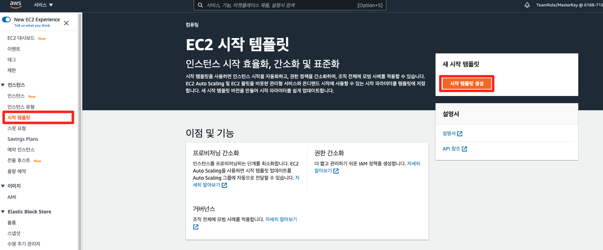
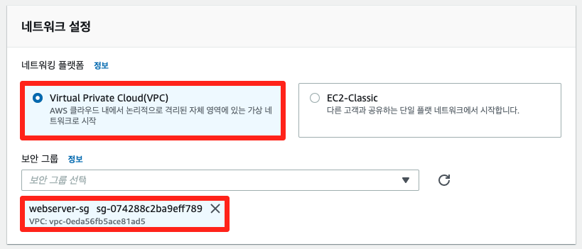

# 6-2. 오토스케일링

## Amazon EC2 Auto Scaling 개념

[Amazon EC2 Auto Scaling](https://docs.aws.amazon.com/ko\_kr/autoscaling/ec2/userguide/what-is-amazon-ec2-auto-scaling.html)를 통해 애플리케이션의 로드를 처리할 수 있는 정확한 수의 Amazon EC2 인스턴스를 보유하도록 보장할 수 있습니다. Auto Scaling 그룹이라는 EC2 인스턴스 모음을 생성합니다. 각 Auto Scaling 그룹의 최소/최대 인스턴스 수를 지정할 수 있으며, 그룹의 크기가 최소/최대 사이 값을 유지합니다. 조정 정책을 지정했다면 Amazon EC2 Auto Scaling에서는 애플리케이션의 늘어나거나 줄어드는 수요에 따라 인스턴스를 시작하거나 종료할 수 있습니다.

Amazon EC2 Auto Scaling를 사용하면 애플리케이션에서는 다음 이점을 누릴 수 있습니다.

* 내결함성 향상 : 인스턴스가 비정상 상태일 때 이를 감지하여 종료한 다음 이를 대체할 인스턴스를 시작할 수 있습니다. 여러 개의 가용 영역을 사용하도록 구성할 수도 있습니다.
* 가용성 향상 : 애플리케이션이 항상 현재 트래픽 요구를 처리할 수 있는 올바른 용량을 갖추도록 도와줍니다.
* 비용 관리 개선 : 필요에 따라 용량을 동적으로 확장 및 축소할 수 있습니다. 사용한 EC2 인스턴스에 대해서만 비용을 지불하므로, 인스턴스가 필요할 때 이를 시작하고 필요 없어지면 종료함으로써 비용을 절감합니다.

본 실습은 아래의 단계로 수행됩니다.

* 시작 템플릿 생성
* 오토스케일링 그룹 생성
* 부하 발생 테스트 후, 오토 스케일링 동작 여부 확인

## 시작 템플릿 생성

1. 오토스케일링 그룹을 생성하기 위해서는 시작 템플릿 또는 시작 구성이 준비되어야 합니다. 본 실습에서는 시작 템플릿을 사용합니다. EC2 콘솔 시작 템플릿 메뉴로 들어가 시작 템플릿 생성 버튼을 클릭합니다.

1. 시작 템플릿의 이름 및 버전 설명을 기재한 후, Auto Scaling 지침 항목 체크 박스에 체크합니다.

1. AMI란에는 세션 진행 동안 만든 AMI(webserver-ami)를 검색하여 선택합니다. 그리고 인스턴스 유형에는 t2.micro를 선택합니다. 본 실습은 서비스용 웹 서버를 올리는 것으로 SSH 접근을 하지 않을 예정입니다. 따라서 키 페어는 사용하지 않습니다.

1. 네트워크 설정 부분에서는 세션 진행 동안 만든 보안 그룹(webserver-sg)을 선택합니다.

1. 리소스 태그에는 아래와 같이 입력하고 리소스 유형은 인스턴스, 볼륨을 선택한 후, 시작 템플릿 생성 버튼을 클릭합니다.

1. 다음 단계 지침을 숙지한 후, 시작 템플릿 보기 버튼을 클릭합니다.

## 오토스케일링 그룹 생성

1. 왼쪽 사이드 바에서 대상 그룹을 선택한 후, 5-1 로드밸런서 생성하기에서 만들었던 대상 그룹(webserver-tg)을 클릭합니다.

1. 대상 탭에서 등록된 대상을 제거합니다.

1. 왼쪽 사이드 바에서 Auto Scaling 그룹을 선택한 후, Auto Scaling 그룹 생성 버튼을 클릭합니다.

1. 단계 1: 시작 템플릿 또는 구성 선택에서 Auto Scaling 그룹 이름에 web-asg를 입력하고, 아래의 시작 템플릿에서 방금 생성한 시작 템플릿(webserver-template)을 선택합니다.

1. 단계2: 설정 구성에서 시작 템플릿 준수 옵션을 선택하고, 네트워크에서 본 실습 때 생성한 VPC(VPC-Lab)과 서브넷을 선택한 후, 다음 버튼을 클릭합니다.

1. 단계3: 고급 옵션 구성에서 5-1 로드밸런서 생성하기에서 생성한 로드 밸런서를 통해, EC2를 시작할 수 있습니다. 로드 밸런서를 연결하면 인스턴스가 시작될 때, 자동으로 오토스케일링 그룹에 등록됩니다. 로드 밸런서가 트래픽을 수신하면 오토스케일링 그룹의 인스턴스 간에 요청을 분산합니다.

또한, 추가 설정의 모니터링 활성화를 통해 오토스케일링 그룹에서 추적할 수 있는 여러 지표를 받을 수 있습니다. 다음 버튼을 클릭합니다.

1. 단계 4: 그룹 크기 및 조정 정책 구성에서 최대/최소 용량 한도를 지정합니다.

조정 정책을 사용하여 트래픽에 따라 오토스케일링 그룹의 크기를 동적으로 조정하도록 설정합니다. 아래와 같이 지표 유형은 평균 CPU 사용률을 선택하고, 대상 값은 30으로 설정하고 다음 버튼을 클릭합니다. 대상 값을 기준으로 EC2 인스턴스를 확장 및 축소합니다.

1. \[옵션] 단계 5: 알림 추가에서 6-1 모니터링에서 생성한 SNS 주제를 설정하여 오토스케일링 이벤트가 발생할 때마다 알림을 받을 수 있습니다. 필요에 따라 설정을 하시거나 바로 다음 단계로 넘어갑니다.

1. 단계 6: 태그 추가에서 아래와 같이 키(Name), 값(asg-web)을 입력합니다.

1. 단계 7: 검토에서 앞서 설정한 정보를 확인한 후, Auto Scaling 그룹 생성 버튼을 클릭합니다.

## 부하 발생 테스트 후, 오토 스케일링 동작 여부 확인

1. 왼쪽 사이드 바에서 로드밸런서를 선택한 후, 5-1 로드밸런서 생성하기에서 만들었던 로드밸런서의 DNS 이름을 복사한 후, 웹 브라우저에 붙여넣습니다.

1. 아래의 화면에서 LOAD TEST 버튼을 클릭하여 부하를 발생시킵니다.

!\[]\(create-alarm-11 1).png)

1. 왼쪽 사이드 바에서 Auto Scaling 그룹을 선택한 후, 앞서 생성한 오토스케일링 그룹을 클릭합니다.

1. 활동 탭에서 작업 기록을 보면 트래픽에 따라 인스턴스를 확장시키는 작업을 수행하고 있음을 파악할 수 있습니다.

1. 모니터링 탭에서도 관련 지표를 확인할 수 있습니다.

1. 왼쪽 사이드 바에서 인스턴스 메뉴를 선택하면 실제 늘어난 인스턴스의 정보를 확인할 수 있습니다.

현재까지의 아키텍처 구성은 아래와 같습니다.

