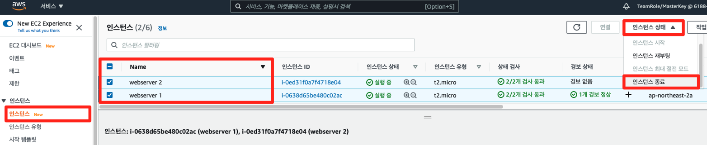
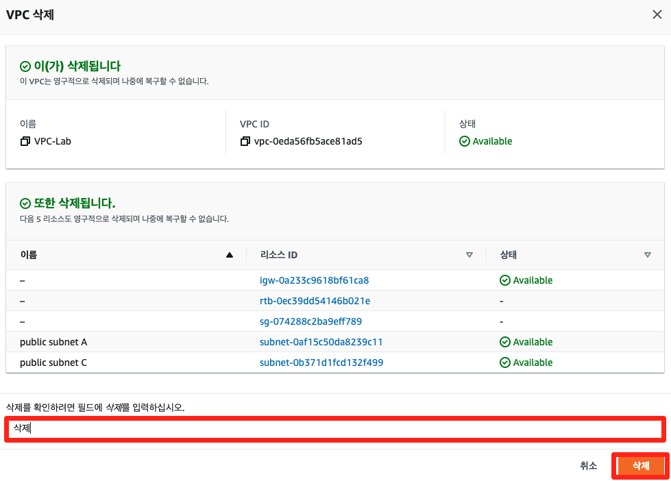

# 세션 실습 자원 삭제

## 로드밸런서 삭제
[EC2 콘솔](https://console.aws.amazon.com/ec2/home?region=ap-northeast-2) 로드밸런서 메뉴에서 오늘 생성한 로드밸런서를 선택한 후, 작업 메뉴에서 삭제 버튼을 클릭하여 삭제합니다.

## EC2 삭제
[EC2 콘솔](https://console.aws.amazon.com/ec2/home?region=ap-northeast-2) 인스턴스 메뉴에서 오늘 생성한 인스턴스를 선택한 후, 인스턴스 상태 메뉴에서 인스턴스 종료를 클릭하여 삭제합니다.

## AMI 삭제
EC2 콘솔 AMI 메뉴에서 오늘 생성한 이미지를 선택한 후, 작업 메뉴에서 등록 취소를 클릭하여 삭제합니다.

## VPC 삭제
만약 추가 실습을 진행했다면 7-2 추가 실습 자원 삭제 부분의 자원을 삭제한 후, 해당 작업을 수행하세요.

[VPC 콘솔](https://console.aws.amazon.com/vpc/home?region=ap-northeast-2) VPC 메뉴에서 오늘 생성한 VPC를 선택한 후, 작업 메뉴에서 VPC 삭제를 클릭하여 삭제합니다.

