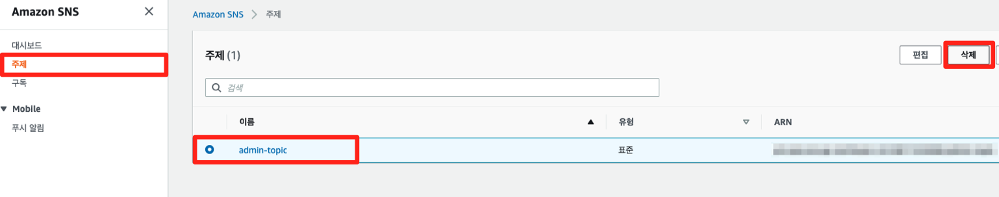
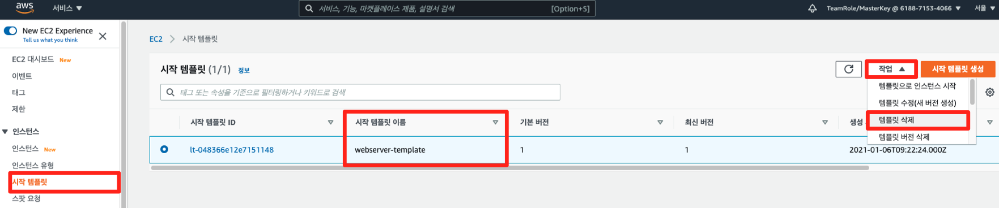
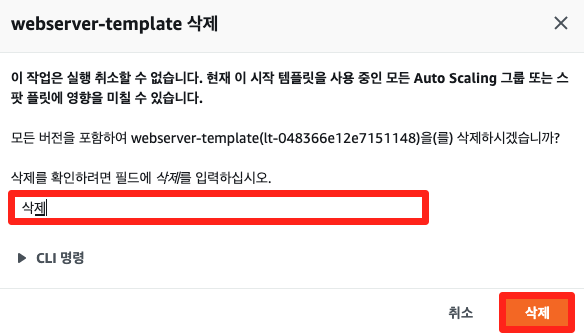
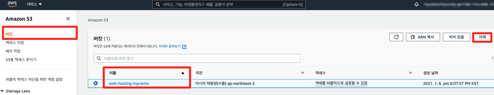
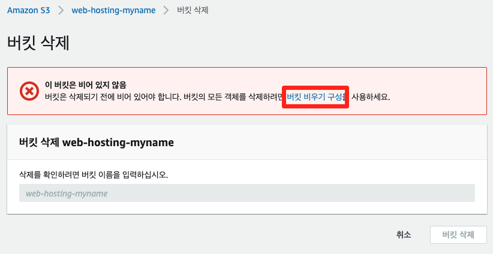
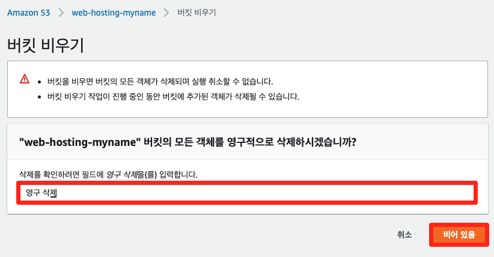
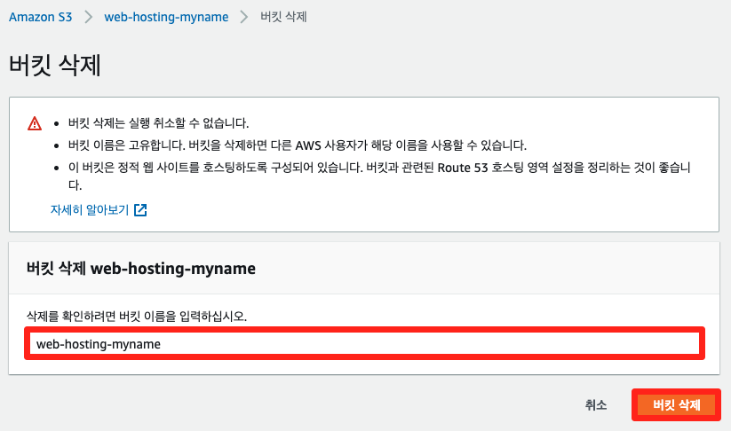

# 7-2. 추가 실습 자원 삭제

## SNS주제 삭제

[SNS 콘솔](https://console.aws.amazon.com/sns/home?region=ap-northeast-2) 주제 메뉴에서 오늘 생성한 주제를 선택한 후, 삭제 버튼을 클릭하여 삭제합니다.

## 오토스케일링 삭제

[EC2 콘솔](https://console.aws.amazon.com/ec2/home?region=ap-northeast-2) 시작 템플릿 메뉴에서 오늘 생성한 시작 템플릿을 선택한 후, 작업 메뉴에서 템플릿 삭제를 클릭하여 삭제합니다.

EC2 콘솔 Auto Scaling 그룹 메뉴에서 오늘 생성한 오토스케일링 그룹을 선택한 후, 삭제 버튼을 클릭하여 삭제합니다.

## S3 버킷 삭제

S3 콘솔 버켓 메뉴에서 오늘 생성한 버킷을 선택 후, 삭제 버튼을 클릭합니다.

버킷을 삭제하기 이전, 남아있는 오브젝트가 있으면 바로 삭제를 할 수 없기에 버킷 비우기 구성을 클릭하여 버킷을 비웁니다.

마지막으로 버킷 삭제를 통해, 생성한 S3 버킷을 삭제합니다.

