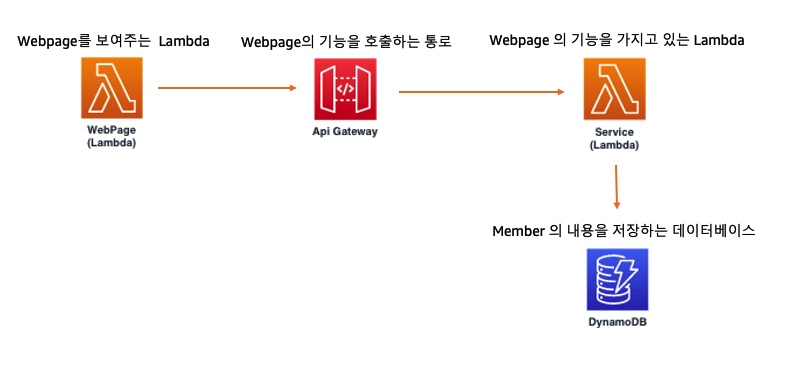

# 서버리스 실습 과정 소개
이번 실습은 AWS 의 대표 서버리스 서비스인 Lambda를 토대로 AWS 기반 서버리스 서비스를 만들어 보는 과정입니다. 복잡한 환경설정을 하지 않고도 간단하게 서비스 하나를 만들어 볼 수 있으며, 향후에 AWS 로 서버리스 서비스나 프로젝트를 만들때에 도움이 되실 수 있습니다.

워크샵은 기본적인 Lambda를 만드는 세션과 그 다음으로는 AWS 의 다른 서버리스 서비스를 덧붙여 보는 세션으로 구성되어 있습니다. 차근차근 따라오시면 간단한 웹서비스를 만들어 보실 수 있습니다.

이번 세션을 잘 따라오신다면, 아래의 그림처럼 만드실 수 있습니다.

